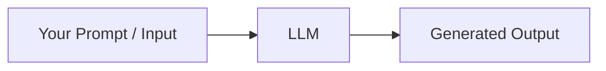
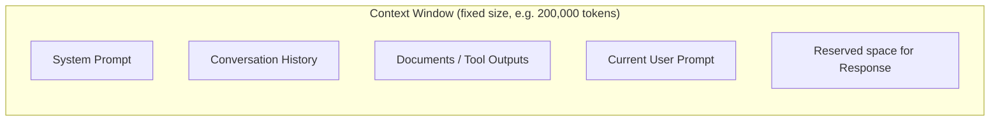

# 1. What is a Prompt?

## The Simple Definition

A **prompt** is the input text you give to a Large Language Model (LLM) to get an output back. That's it at the core — but there's a lot of nuance underneath that simple idea, and understanding that nuance is what "prompt engineering" actually is.

Think of an LLM like a extremely well-read but literal-minded assistant who has no memory of you, no access to your screen, and can only react to exactly what you type. The prompt is the *entire* world that assistant sees at that moment. Whatever isn't in the prompt (or the conversation history) simply does not exist for the model.



## Why Prompts Matter So Much

Unlike traditional software — where you write code and the computer does *exactly* what the code says — an LLM's behavior is **probabilistic**. It predicts the most likely next word (technically "token") based on patterns learned during training. This means:

- The **same model** can give **different quality answers** depending on how a question is phrased.
- Small wording changes ("explain" vs "list" vs "summarize") can significantly change the output.
- There's no fixed "correct" prompt — but there are much better and much worse ones for a given goal.

This is why prompt engineering exists as a discipline: **you are programming the model using natural language instead of code.**

## Tokens — The Real Unit of a Prompt

The model doesn't see your prompt as words or characters. It sees **tokens** — small chunks of text (roughly ¾ of a word on average in English). For example:

| Text | Token breakdown (approximate) |
|------|-------------------------------|
| "prompting" | `prompt` + `ing` |
| "Hello world!" | `Hello` + ` world` + `!` |
| "unbelievable" | `un` + `believ` + `able` |

Why this matters practically:
- Every model has a **maximum number of tokens** it can process at once (input + output combined). This is the **context window**.
- Longer prompts cost more (in API pricing) and use up more of the context window, leaving less room for the response.
- Non-English text, code, and rare words often use *more* tokens per "word" than plain English.

## The Context Window

The **context window** is the total memory span of a single interaction — it includes:
1. The system prompt (instructions/persona)
2. All previous messages in the conversation (user + assistant)
3. Any documents/tool outputs pasted in
4. The current prompt
5. The space reserved for the model's response



**Key insight:** if the conversation gets too long, older content may need to be dropped or summarized, because the total can never exceed the context window size. This becomes critical later when you build agents that loop repeatedly (Phase F topics) — each loop iteration adds more tokens to the window.

## Prompt vs Query vs Instruction — Clearing Up Terms

These words get used loosely, so here's the distinction:

- **Prompt** — the complete input sent to the model (can include instructions, context, examples, and the actual question).
- **Query** — informally, just the "question" part of a prompt (more of a search-engine term, but often borrowed for LLMs).
- **Instruction** — a directive telling the model *what to do* (e.g., "Summarize this in 3 bullet points"). An instruction is usually one component *inside* a prompt.

So: a **prompt** can be built out of an **instruction** + supporting **context** + maybe an **example**. We'll go deeper into these building blocks in the next note (Prompt Structure & Components).

## A Minimal Example

**Weak prompt:**
```
Tell me about dogs.
```
This is vague. The model has to guess: Do you want a biology lesson? Breed recommendations? A fun fact? History? It will produce *something*, but it's essentially guessing your intent.

**Better prompt:**
```
You are a veterinarian. In 3 bullet points, explain why dogs need regular
exercise, written for a first-time dog owner.
```
This gives the model a **role**, a **format**, a **topic focus**, and an **audience** — all of which narrow down the space of possible "correct" answers, making the output far more predictable and useful.

## Key Takeaways

- A prompt is the *entire* input the model sees — nothing more, nothing less. If you didn't say it, the model doesn't know it.
- LLMs process **tokens**, not words — this affects cost, limits, and how much you can fit in one request.
- The **context window** is a hard ceiling on how much information (system + history + input + output) exists in one interaction.
- Prompt engineering exists because model behavior is **probabilistic**, not deterministic — wording changes outcomes.
- A good prompt reduces ambiguity by supplying role, format, audience, and focus — which is exactly what the next topic covers in detail.

---
**Next up:** `02-prompt-structure-components.md` — breaking down the anatomy of a well-formed prompt (role, context, instruction, constraints, output format).
