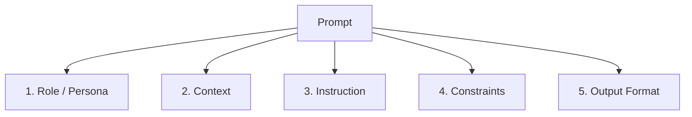

# 2. Prompt Structure & Components

## Why This Matters for Developers

If you're used to writing structured code, think of a prompt the same way you'd think of a function call: it has **parameters** that shape the behavior of the "function" (the LLM). A vague prompt is like calling a function with no arguments and hoping it does the right thing. A well-structured prompt is like calling that function with all the right arguments explicitly set.

```java
// Bad: no parameters, ambiguous intent
llm.call("Tell me about the order");

// Good: explicit "parameters" baked into the prompt text
llm.call("""
    Role: You are a customer support assistant for an e-commerce platform.
    Context: Order #4521 was placed 5 days ago and has not shipped yet.
    Instruction: Write a short, empathetic message to the customer explaining
    the delay and offering a $10 credit.
    Format: Plain text, max 3 sentences.
""");
```

Both are "prompts," but only one gives predictable, production-usable output.

## The Five Core Components

Every well-formed prompt is built from some combination of these five building blocks. Not every prompt needs all five — but knowing them lets you deliberately choose what to include.



### 1. Role / Persona

Tells the model *who* it should act as. This sets tone, vocabulary, and depth of the response.

```
You are a senior Java backend engineer reviewing a pull request.
```

**Why it matters for devs:** Setting a role is one of the highest-leverage, lowest-effort ways to steer output quality. "Act as a security auditor" vs "act as a friendly tutor" will produce very different reviews of the *same* code.

> In the Anthropic/OpenAI APIs, role is often set via the **system prompt** — see Topic 4 (`system-vs-user-vs-assistant-messages`) for exactly how this maps to the actual API message structure.

### 2. Context

The background information the model needs but doesn't already know — your codebase conventions, business rules, prior decisions, data, error logs, etc.

```
Context: Our team uses Spring Boot 3.2 with Java 21. We follow a
layered architecture (Controller -> Service -> Repository). All
DTOs are immutable records.
```

**Why it matters for devs:** This is the equivalent of dependency injection — you're injecting the facts the model needs so it doesn't hallucinate assumptions about your stack.

### 3. Instruction

The actual task/action you want performed. This should be a clear, direct verb-first statement.

```
Instruction: Refactor the following method to use the Optional API
instead of null checks.
```

**Tip:** Put the instruction in imperative form ("Refactor...", "Generate...", "List...", "Explain...") rather than a vague question ("Can you help me with..."). Imperative instructions are unambiguous about what action is expected.

### 4. Constraints

Boundaries and rules the output must respect — things NOT to do, limits, tone restrictions, or technical requirements.

```
Constraints:
- Do not change the method signature.
- Do not introduce new external dependencies.
- Keep cyclomatic complexity low; prefer early returns.
```

**Why it matters for devs:** Constraints are like unit test assertions for behavior — they narrow the acceptable output space and prevent the model from "helpfully" doing more than asked (e.g., rewriting unrelated code).

### 5. Output Format

Specifies exactly how the response should be structured — this is critical when the output will be **parsed programmatically** (e.g., by your application code).

```
Output format: Return ONLY a JSON object with keys "refactoredCode"
(string) and "explanation" (string). No markdown, no extra text.
```

We'll cover this in much more depth in Topic 9 (`structured-output-prompting`), since getting reliable structured output is one of the most important skills for integrating LLMs into real applications.

## Putting It All Together — A Full Example

```
Role: You are a senior Java backend engineer conducting a code review.

Context: This is a Spring Boot 3.2 REST controller. The team standard
requires input validation to happen at the controller level using
Jakarta Bean Validation annotations, not manual if-checks.

Instruction: Review the following controller method and identify
validation issues.

Constraints:
- Only flag validation-related issues, not style/formatting.
- Do not rewrite the entire method — suggest targeted diffs only.
- Limit response to a maximum of 5 issues.

Output format: Return a numbered list. Each item: one line describing
the issue, followed by a one-line suggested fix.

Code:
<paste code here>
```

Notice how each labeled section does a specific job. This labeled structure isn't magic syntax the model requires — it's a **convention that removes ambiguity for both you and the model**. You could equally use XML-style tags, which many models (including Claude) parse very reliably:

```xml
<role>You are a senior Java backend engineer conducting a code review.</role>
<context>Spring Boot 3.2 REST controller...</context>
<instruction>Review the following controller method...</instruction>
<constraints>
- Only flag validation-related issues.
- Limit to 5 issues.
</constraints>
<output_format>Numbered list, one issue + one fix per line.</output_format>
<code>
  <paste code here>
</code>
```

**Developer tip:** XML-style tags are especially useful when you're building prompts programmatically (e.g., string-templating in Java/Python), because tags are easy to inject variables into and easy for the model to distinguish from natural-language instructions.

## Component Priority — What to Include When

Not every prompt needs every component. Use this as a quick decision guide:

| Situation | Components typically needed |
|---|---|
| One-off simple question | Instruction only |
| Reusable prompt for a specific persona/tool | Role + Instruction |
| Task involving your specific codebase/business rules | Role + Context + Instruction |
| Output feeds into another system (API, parser) | + Output Format |
| High-stakes or narrow task (production code, financial data) | All five, with explicit Constraints |

## Common Mistake: Burying the Instruction

A frequent developer mistake is writing a huge wall of context and constraints, then tacking the actual instruction on as an afterthought at the end. Models — like humans skimming a long ticket description — can lose track of the actual ask when it's buried.

**Fix:** Either put the instruction first, or clearly separate it into a distinct section/tag so it can't be missed, as shown in the examples above.

## Key Takeaways

- Treat a prompt like a function call: Role, Context, Instruction, Constraints, and Output Format are its "parameters."
- Not all five are always needed — pick based on task complexity and whether the output will be consumed by code or a human.
- Use clear structural separation (labeled sections or XML tags) rather than one long paragraph — this reduces ambiguity for the model and makes prompts easier to template/reuse in code.
- Constraints act like test assertions — they narrow what "correct" output looks like.
- Output Format is essential whenever your application code will parse the response — covered in depth in Topic 9.

---
**Next up:** `03-zero-shot-vs-few-shot.md` — how providing (or not providing) examples inside the prompt changes model behavior.
