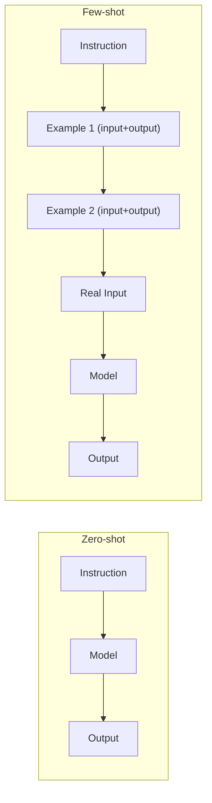

# 3. Zero-shot vs Few-shot Prompting

## The Core Idea

This topic is about **whether you show the model examples of what you want** before asking it to do the task.

- **Zero-shot** = you give an instruction with **no examples**. The model relies purely on what it learned during training.
- **Few-shot** = you give the instruction **plus 1-5 (or more) worked examples** showing input → desired output, before the real task.



## Zero-shot Prompting

```
Instruction: Classify the sentiment of the following review as
POSITIVE, NEGATIVE, or NEUTRAL.

Review: "The battery life is decent but the app crashes constantly."
```

This works because sentiment classification is a very common task type the model has seen enormous amounts of during training — it doesn't need hand-holding to understand what "classify sentiment" means.

**When to use zero-shot (with reasoning):**

| Use zero-shot when... | Reason |
|---|---|
| The task is common/general (summarization, translation, sentiment, simple Q&A) | The model has almost certainly seen thousands of similar tasks during training, so extra examples add little value. |
| You want to minimize token usage / cost | Fewer tokens per request = lower API cost and more context window left for real content. |
| You need to keep the prompt short and fast (e.g., a real-time chat feature) | Every added example increases latency (more tokens to process) before generation even starts. |

## Few-shot Prompting

```
Instruction: Classify the sentiment of the review as POSITIVE, NEGATIVE, or NEUTRAL.

Example 1
Review: "This is the best purchase I've made all year!"
Sentiment: POSITIVE

Example 2
Review: "It arrived broken and support never replied."
Sentiment: NEGATIVE

Example 3
Review: "It's fine. Does what it says, nothing special."
Sentiment: NEUTRAL

Now classify:
Review: "The battery life is decent but the app crashes constantly."
Sentiment:
```

**Why this helps (the reasoning):** The examples don't just describe the *category labels* — they demonstrate the exact **output format** ("Sentiment: POSITIVE" not "This review is positive" or "positive"), and they narrow down **edge-case judgment calls** (e.g., how to treat a mixed review like the battery/app example). This is the single biggest practical benefit of few-shot: it disambiguates format and edge-case behavior far more reliably than describing it in prose.

**When to use few-shot (with reasoning):**

| Use few-shot when... | Reason |
|---|---|
| Output must follow a very specific, non-obvious format | Showing the exact shape of the output is more reliable than describing it in words — the model pattern-matches to the examples directly. |
| The task is domain-specific or unusual (internal ticket categories, custom label taxonomy) | The model has no training-time exposure to your custom categories, so examples are the only way to teach the mapping. |
| You've observed the model getting a specific edge case wrong in zero-shot | Adding an example targeting exactly that edge case is one of the most effective, low-cost fixes — cheaper than fine-tuning, faster than a support ticket to the model provider. |
| Consistency across many calls matters (e.g., a production classification pipeline) | Examples reduce variance in output between calls, which is critical when your code downstream expects a stable format. |

## The Trade-off (Backed by Reasoning)

Few-shot isn't strictly "better" — it's a trade-off:

| Factor | Zero-shot | Few-shot |
|---|---|---|
| Token cost per call | Lower | Higher (examples cost tokens every single call) |
| Latency | Lower | Higher |
| Output consistency | Lower, especially for unusual formats | Higher — examples act as a strong prior |
| Maintenance | Nothing to maintain | Examples need updating if requirements or edge cases change |

**Practical reasoning for developers:** If you're calling an LLM thousands of times a day in production (e.g., classifying support tickets), every few-shot example is duplicated token cost on *every single call*. This is why, in production systems, teams often start with few-shot to nail down behavior, then work to **reduce the number of examples down to the minimum that still gets reliable output** — because the marginal cost adds up fast at scale. This connects directly to Topic 17 (`prompt-compression`).

## Choosing Example Quality Over Quantity

A common mistake is throwing in many examples assuming "more is better." In practice:

- **2-3 well-chosen examples that cover distinct edge cases** usually outperform 10 similar/redundant examples.
- **Reasoning:** The model is pattern-matching against the *variety* of examples shown, not just the count. Ten examples that are all "obviously positive reviews" don't teach the model anything about ambiguous or negative cases — they just cost tokens.
- **Order can matter too** — models can show a slight recency bias toward the last example shown. If your examples aren't logically ordered, this can subtly skew results. If you notice this happening in testing, try shuffling example order and re-testing (this becomes systematic in Topic 12, `prompt-evaluation-testing`).

## One-shot as a Middle Ground

Sometimes you'll see "one-shot" prompting called out separately — this is just few-shot with exactly one example. It's worth knowing as a specific term because a single well-chosen example is often enough to lock in a format, without paying the token cost of 3-5 examples.

```
Instruction: Extract the order ID and status from the message below.
Return as JSON.

Example:
Message: "Your order #A1023 has shipped and will arrive Thursday."
Output: {"orderId": "A1023", "status": "shipped"}

Now extract from:
Message: "Order #B2044 was cancelled per your request."
Output:
```

**Reasoning:** If the format is simple and the task is close to something the model already understands well, one example is often enough to remove ambiguity — going straight to 3+ examples in that case is usually wasted token spend.

## Key Takeaways

- **Zero-shot**: no examples, relies on the model's general training. Best for common tasks where you want to save tokens/latency.
- **Few-shot**: instruction + examples. Best for unusual formats, custom domains, or when you've found a specific failure mode to correct.
- The core value of few-shot isn't teaching new knowledge — it's **disambiguating format and edge-case behavior**.
- Always weigh token/latency cost against the reliability gain — this is especially important once you're calling models programmatically at scale.
- Prefer a small number of *diverse* examples over a large number of *similar* ones — diversity, not volume, is what improves the model's judgment on edge cases.

---
**Next up:** `04-system-vs-user-vs-assistant-messages.md` — how prompt components map to the actual message roles used in real LLM APIs.
