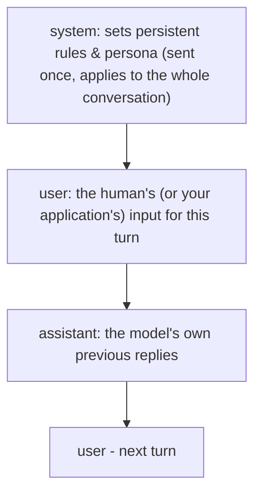

# 4. System Prompts vs User Prompts vs Assistant Messages

## Why This Topic Exists

Topics 1-3 talked about prompts conceptually. But when you actually call an LLM API (Anthropic, OpenAI, etc.), you don't send one blob of text — you send a **structured list of messages**, each tagged with a **role**. Understanding these roles precisely matters because they behave differently and are treated with different levels of "authority" by the model. Getting this wrong is one of the most common mistakes developers make when integrating LLMs into applications.

## The Three Roles



### 1. `system` — Persistent Instructions

The system prompt is where you set:
- The model's **role/persona**
- **Global rules and constraints** that should apply to every response
- **Output format requirements** that should hold for the entire conversation, not just one message

```json
{
  "model": "claude-sonnet-4-6",
  "system": "You are a backend code review assistant for a Java/Spring Boot team. Always respond with a numbered list of issues. Never suggest changing public method signatures unless explicitly asked.",
  "messages": [
    { "role": "user", "content": "Review this controller method: ..." }
  ]
}
```

**Why put rules in `system` instead of the first user message (reasoning):**
- The system prompt is designed to have **higher instruction-following priority** than user messages — models are trained to treat it as the "operating rules," not just another request. Anthropic's Claude models in particular are trained to weight system prompts heavily.
- It stays out of the visible conversation history shown to the end user, keeping your internal rules separate from what a user sees or could try to argue with.
- It only needs to be set **once per session**, not repeated in every user message — this saves tokens across a multi-turn conversation compared to re-stating rules every turn.

### 2. `user` — The Actual Input for This Turn

This is the human's message, or — in an application you're building — whatever your code assembles as the "current ask": a question, a document to summarize, tool results being fed back in, etc.

```json
{ "role": "user", "content": "Summarize this error log: <log text>" }
```

**Developer note:** In agentic systems (which you'll get to in Phase F), the `user` role is also commonly used to feed **tool results** back to the model after a function call — this matters a lot once you build ReAct loops (Topic 20), because the model needs to see the outcome of its own tool call as if it were new "input."

### 3. `assistant` — The Model's Own Prior Replies

When you're building a multi-turn conversation, you don't just send the latest user message — you send the **entire history**, including the model's own past responses tagged as `assistant`. This is what lets the model "remember" earlier parts of the conversation (LLMs have no memory of their own between API calls — the memory is an illusion created by resending history).

```json
{
  "system": "You are a Java backend code review assistant.",
  "messages": [
    { "role": "user", "content": "Review this method for null-safety issues." },
    { "role": "assistant", "content": "I found 2 issues: ... " },
    { "role": "user", "content": "Now also check for thread-safety." }
  ]
}
```

**Why this matters (reasoning):** Every single call to the API is stateless — the model has zero memory outside of what's in this `messages` array. If your application "forgets" to re-send earlier assistant replies, the model will have no idea what "also check for thread-safety" is referring to. This is a very common bug in early LLM integrations — treat the `messages` array as **the entire memory of the conversation**, full stop.

## A Concrete Java-side Example

```java
// Using the Anthropic Messages API structure
Map<String, Object> requestBody = Map.of(
    "model", "claude-sonnet-4-6",
    "max_tokens", 1024,
    "system", "You are a senior Java code reviewer. Be concise and specific.",
    "messages", List.of(
        Map.of("role", "user", "content", "Review this DAO class for SQL injection risk."),
        Map.of("role", "assistant", "content", "I found one risk: string concatenation in the WHERE clause on line 42."),
        Map.of("role", "user", "content", "Can you show the fixed version using PreparedStatement?")
    )
);
```

**Reasoning for why `system` is a separate top-level field (not just another message):** Anthropic and most providers deliberately keep `system` outside the `messages` array. This reinforces that it isn't "part of the conversation" — it's configuration for how the model should behave across the whole conversation, similar to how you'd set a config value once rather than pass it as an argument to every function call.

## Common Mistake #1: Putting Rules in `user` Instead of `system`

```
// Weaker approach
{ "role": "user", "content": "You are a Java code reviewer. Always respond in bullet points. Now review this method: ..." }
```

**Why this is weaker (reasoning):** Mixing persistent rules into the same message as the actual task makes it easy for the rule to get "drowned out" by the specific task content, especially in longer messages. It also means you have to **repeat the rule in every single user message** in a multi-turn conversation, which wastes tokens and risks inconsistency if you forget to repeat it in a later turn.

## Common Mistake #2: Forgetting to Resend Assistant Messages

If your backend code only stores and resends `user` messages (dropping the model's own replies), the model will lose all continuity and start contradicting itself, because from its point of view, previous "assistant" turns never happened.

**Fix:** Persist the full message list (system + all user/assistant turns) per conversation/session on your backend — this is exactly the "conversation memory" you'll formalize further in Phase 2 of your agent-building roadmap.

## Common Mistake #3: Faking Assistant Messages to "Prime" Behavior

Some developers insert a fake `assistant` message (one the model never actually said) to try to steer future responses, e.g., pretending the model already agreed to a format. This can work as an advanced technique (sometimes called "prefilling"), but:

**Reasoning for caution:** it's fragile — if the fake content doesn't match how the model would naturally respond, it can cause confusing or lower-quality continuations, because the model is now "continuing" a reply that doesn't reflect its actual reasoning. Use `system` for standing rules first; reach for assistant-message prefilling only as a deliberate, tested technique later on.

## Quick Reference Table

| Role | Set by | Frequency | Purpose | Reasoning for use |
|---|---|---|---|---|
| `system` | You (developer) | Once per session | Persona, global rules, standing format requirements | Highest instruction-following priority; avoids repeating rules every turn |
| `user` | Human or your app code | Every turn | The actual ask, or tool results being fed back | Represents "new information" the model must react to |
| `assistant` | The model (echoed back by you) | Every turn after the first response | Preserves conversational memory | The API is stateless — without resending this, the model has no memory of its own prior replies |

## Key Takeaways

- LLM APIs use a **structured messages array with roles**, not a single text blob — this is the real, code-level shape of "a prompt."
- `system` is for persistent, high-priority rules and persona — set once, applies throughout.
- `user` carries the actual task/input for the current turn (and, in agent systems, tool results).
- `assistant` messages must be resent every call to preserve conversational memory — the model itself has none between calls.
- Keep standing rules in `system`, not repeated inside `user` messages — this is both more reliable and cheaper (fewer tokens repeated every turn).

---
This completes **Phase A: Foundations**. Next: `05-in-context-learning.md`, the first topic of **Phase B: Core Techniques**.
