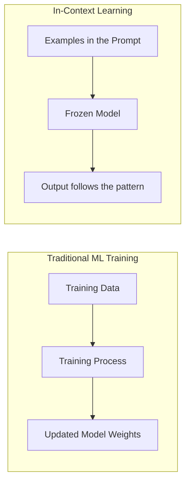

# 5. In-Context Learning

## What It Actually Means

**In-context learning (ICL)** is the ability of an LLM to "learn" a new task or pattern **just from what's in the prompt**, without any retraining or fine-tuning of the model's weights. This is the mechanism that makes few-shot prompting (Topic 3) actually work — it's the "why" behind that "what."

This is fundamentally different from how traditional ML/software systems "learn":



**Key distinction for developers:** In traditional ML, "learning" means updating the model's parameters (weights) via gradient descent on a dataset — a slow, offline process. In-context learning involves **zero weight updates**. The model's weights are completely frozen; it's just using the examples in front of it, right now, to infer a pattern and apply it — similar to how you might infer a regex pattern from three example strings without writing the regex explicitly.

## Why This Matters (The Reasoning)

Understanding that ICL involves no weight updates has real practical consequences:

| Implication | Reasoning |
|---|---|
| The "learning" only lasts for this one request | Since weights aren't updated, nothing is retained after the API call ends — every new request starts from the same frozen model state. |
| You must re-supply examples every time you want that pattern | There's no persistent memory of the pattern being "learned" — this is why few-shot examples cost tokens on every single call (as noted in Topic 3). |
| ICL can't teach the model genuinely new facts/knowledge it never saw in training | It can only help the model recognize and apply a *pattern* using knowledge/reasoning it already has — it cannot inject facts the model has zero prior exposure to and have it "know" them reliably afterward. For injecting new factual knowledge, you need Retrieval-Augmented Generation (Topic 18), not ICL. |
| ICL is why prompt engineering is so powerful without needing a data science team | Anyone who can write a good prompt with good examples can steer model behavior — no training pipeline, GPUs, or MLOps required. |

## A Simple Demonstration

Suppose you want the model to convert casual dates into ISO format — a fairly arbitrary formatting convention it might not default to.

**Zero-shot (relying on default behavior):**
```
Convert to ISO date format: "next Monday, March 3rd"
```
The model will guess at what "ISO format" means to you and might return `2025-03-03` or write it out differently — behavior is underspecified.

**In-context learning via examples:**
```
Convert casual dates to ISO 8601 format.

"Jan 5th, 2024" -> "2024-01-05"
"March 3rd" -> "2025-03-03"
"today" -> "2025-07-26"

Now convert: "next Monday, March 3rd"
```
Here, the model isn't being taught *what ISO 8601 is* from scratch (it already knows that from training) — it's inferring, from the pattern of examples, exactly which conventions you want applied (e.g., how you're resolving relative dates like "today" or "next Monday" against a reference date). That's in-context learning in action: pattern recognition applied fresh, per request.

## The Two Flavors of In-Context Learning

### 1. Pattern Demonstration (most common — same as few-shot)
Show input→output pairs, let the model infer the mapping. Covered thoroughly in Topic 3.

### 2. Instructional ICL (rule stated directly, no examples)
You can also achieve in-context learning by directly stating a rule in the prompt, rather than showing examples of it:
```
When converting dates, always resolve relative terms like "today" or
"next Monday" against 2025-07-26 as the reference date, and output in
ISO 8601 (YYYY-MM-DD) format.
```
**Reasoning for choosing this over examples:** If the rule is easy to state precisely in words, direct instruction is often more token-efficient than 3+ examples, and just as reliable. Reserve example-based ICL for cases where the pattern is easier to *show* than to *describe* (e.g., a very specific tone of voice, or a non-obvious output structure).

## Why ICL Has Limits — And Why This Matters for Agent-Building

Because ICL doesn't change the model's underlying knowledge, it has real boundaries:

- **It can't make the model reliably know facts past its training cutoff** (e.g., "who won the game yesterday") — no amount of clever in-context examples fixes a knowledge gap; you need to feed the actual data in via context (retrieval) instead.
- **It can't make the model perform a task requiring capabilities it fundamentally lacks** — e.g., precise multi-digit arithmetic — examples won't "teach" it to calculate correctly; you'd instead give it a tool (a calculator function) to call, which is exactly the motivation behind Tool-Use Prompting (Topic 19).
- **The pattern only holds within the current context window** — if the conversation grows very long and the examples fall out of the window (or get summarized away), the model reverts to its default behavior for that task.

This is a preview of a very important theme in agent design: **in-context learning handles "how to behave," while tools and retrieval handle "what to know."** Keeping this distinction clear will save you a lot of debugging time later when your agents seem to "forget" instructions or "hallucinate" facts — often the actual fix is providing missing context or a tool, not adding more examples.

## Practical Guidance for Developers

| Situation | What to do | Reasoning |
|---|---|---|
| Model picks wrong tone/format consistently | Add 1-3 examples demonstrating the correct pattern | ICL is very effective for style/format correction — it's essentially "showing, not telling" |
| Model gives outdated or wrong factual answers | Don't add more examples — add real data via context or retrieval | ICL cannot inject facts the model wasn't trained on; more examples won't fix a knowledge gap |
| Model fails at precise computation/logic | Give it a tool/function to call instead of trying to prompt around it | Some tasks are fundamentally unsuited to token-prediction-based reasoning alone |
| You need the pattern to hold across a very long agent loop | Periodically re-inject the key examples/rules, don't assume they persist indefinitely | Context windows are finite, and older content can get pushed out or summarized away in long-running loops |

## Key Takeaways

- In-context learning is the mechanism that lets a model apply a pattern from the current prompt **without updating its weights** — nothing is "remembered" after the call ends.
- It's why few-shot examples work, but also why they must be resent on every call.
- ICL is great for teaching *behavior/format/tone*; it is not a substitute for real knowledge injection (retrieval) or precise computation (tools).
- Recognizing which category a failure falls into (behavior vs. knowledge vs. computation) is a core debugging skill you'll rely on constantly once you move into agent-building.

---
**Next up:** `06-chain-of-thought.md` — prompting the model to reason step-by-step before answering.
