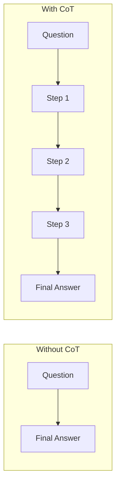

# 6. Chain-of-Thought (CoT) Prompting

## The Core Idea

**Chain-of-Thought prompting** means instructing the model to work through a problem **step by step, out loud, before giving the final answer** — instead of jumping straight to a conclusion.



## Why This Works (The Reasoning Behind It)

Remember: an LLM generates output **one token at a time**, and each new token is predicted based on everything generated so far (including its own previous tokens). This has an important consequence:

**If the model is forced to jump straight to a final answer, it has to do all the "thinking" internally, in one shot, before producing a single token — and it can't revise course.** But if you let it write out intermediate steps first, each step becomes additional context that the *next* step (and the final answer) can build on. In effect, **you're giving the model a scratchpad**, and the act of writing down each step measurably improves accuracy on tasks that require multi-step logic (arithmetic, multi-hop reasoning, planning).

**Developer analogy:** This is similar to why breaking a complex function into smaller, named intermediate variables (rather than one giant nested expression) reduces bugs — not because the underlying computation changed, but because writing it stepwise gives you (and, here, the model) a chance to verify each intermediate piece rather than trying to get the whole thing right in one leap.

## Basic Example

**Without CoT:**
```
Q: A store had 120 apples. They sold 35% on Monday and 20 more on
Tuesday. How many apples are left?
A:
```
A model might rush this and make an arithmetic slip, especially under time/token pressure to answer immediately.

**With CoT:**
```
Q: A store had 120 apples. They sold 35% on Monday and 20 more on
Tuesday. How many apples are left?

Think through this step by step before giving the final answer.
```

The model's output might look like:
```
Step 1: 35% of 120 = 42 apples sold on Monday.
Step 2: Remaining after Monday = 120 - 42 = 78 apples.
Step 3: 20 more sold on Tuesday: 78 - 20 = 58 apples.
Final answer: 58 apples.
```

## The Magic Phrase — "Let's think step by step"

Research on this technique found that simply appending a phrase like **"Let's think step by step"** (or "Think through this carefully before answering") to a prompt — with **zero examples** — noticeably improves performance on reasoning-heavy tasks. This specific finding is called **zero-shot CoT**, and it's worth knowing by name because it's the cheapest possible way to try this technique (no examples needed, just one added sentence).

## Few-shot CoT — Combining Topics 3 and 6

You can also combine chain-of-thought with few-shot prompting (Topic 3) by showing worked examples that *include* the reasoning steps, not just the final answer:

```
Q: A train travels 60 miles in 1.5 hours. What is its average speed?
Reasoning: Speed = distance / time = 60 / 1.5 = 40 mph.
A: 40 mph.

Q: A store had 120 apples. They sold 35% on Monday and 20 more on
Tuesday. How many apples are left?
Reasoning:
```

**Reasoning for using few-shot CoT over zero-shot CoT:** If your task has a very specific reasoning *style* you want replicated (e.g., always show the formula before plugging in numbers, or always double-check the final answer against constraints), showing 1-2 worked examples locks in that style far more reliably than a generic "think step by step" instruction — this is the same "showing vs. describing" trade-off you saw in Topic 5 (In-Context Learning).

## When CoT Helps — And When It Doesn't (Backed by Reasoning)

| Task type | Does CoT help? | Reasoning |
|---|---|---|
| Multi-step math/arithmetic | Yes, significantly | Breaking into steps prevents the model from having to hold the entire calculation "in its head" across a single leap |
| Multi-hop logical reasoning (e.g., "if A implies B, and B implies C...") | Yes, significantly | Each hop becomes explicit, reducing the chance of skipping a link in the chain |
| Code debugging / tracing execution | Yes | Walking through variable states line-by-line mirrors how a human debugger would trace the bug |
| Simple factual recall ("What is the capital of Japan?") | No, and may add latency for no benefit | There's no reasoning chain to construct — the answer is a direct lookup, not a derivation |
| Simple classification (e.g., basic sentiment) | Usually no | Same reasoning — no intermediate steps genuinely needed; forcing them just adds tokens/latency without accuracy gain |

**Practical implication for developers:** Don't blanket-apply "think step by step" to every prompt in your system. For simple lookup/classification tasks, it adds token cost and latency with little to no accuracy benefit. Reserve it for tasks that genuinely involve multi-step derivation.

## Important Caveat: CoT Text Is Not Always a Faithful Trace

A crucial thing to understand as a developer: the reasoning text the model produces **is not guaranteed to be an accurate description of the actual internal process** that produced the answer. It's the model's best *articulation* of a plausible reasoning path, generated the same token-by-token way as any other output — not a debugger's log of its internal computation.

**Practical implication:** Don't treat CoT output as a verified audit trail for compliance/legal purposes, and don't assume that because the steps "look right," the final answer is definitely correct — always validate outputs where correctness actually matters (see Topic 12, `prompt-evaluation-testing`, and Topic 14, `ambiguity-hallucination-mitigation`).

## CoT and Structured Output — A Common Conflict

If you need the final output in a strict format (e.g., pure JSON for programmatic parsing — Topic 9), be careful: asking the model to "show your reasoning" and "return only JSON" in the same breath can produce mixed output that's hard to parse, since the reasoning text and JSON might get mixed together.

**Recommended pattern (with reasoning):**
```
Think through the problem step by step.
Then, on a new line, output ONLY the final answer as JSON in the
exact format: {"answer": <value>}
```
By explicitly separating "reasoning space" from "final answer space" with a clear instruction and marker (e.g., "on a new line," a delimiter, or an XML tag like `<answer>`), you preserve the accuracy benefits of CoT while still being able to reliably extract just the structured part programmatically — e.g., by splitting on the marker or parsing content inside the tag.

## Key Takeaways

- CoT prompting asks the model to reason step-by-step before answering, which acts like a "scratchpad" that measurably improves accuracy on multi-step reasoning tasks.
- The simplest version — zero-shot CoT — is just adding "think step by step" to your prompt, no examples required.
- Few-shot CoT (worked examples that include reasoning) locks in a specific reasoning style more reliably than the generic phrase alone.
- Don't apply CoT to simple lookup/classification tasks — it adds cost/latency without benefit there.
- CoT text is not a verified trace of internal computation — treat it as the model's best articulation, and validate outputs separately when correctness genuinely matters.
- When you need strict structured output alongside CoT, explicitly separate the reasoning section from the final answer with a clear marker so your code can reliably parse just the answer.

---
**Next up:** `07-self-consistency-tree-of-thought.md` — techniques that go beyond a single reasoning chain by sampling and comparing multiple reasoning paths.
