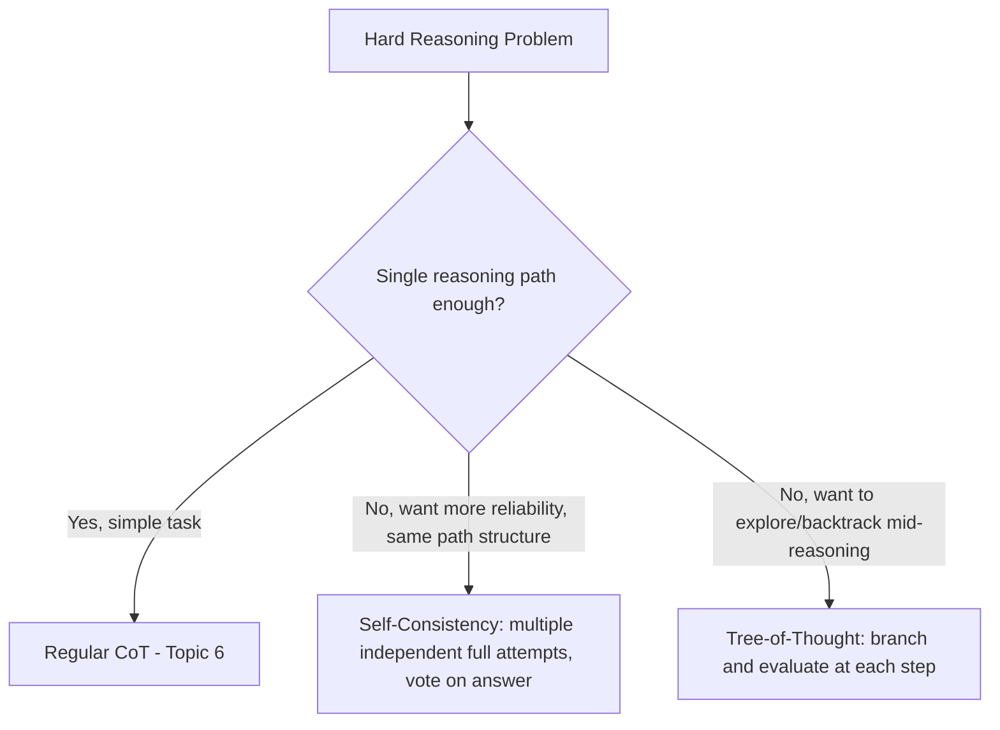
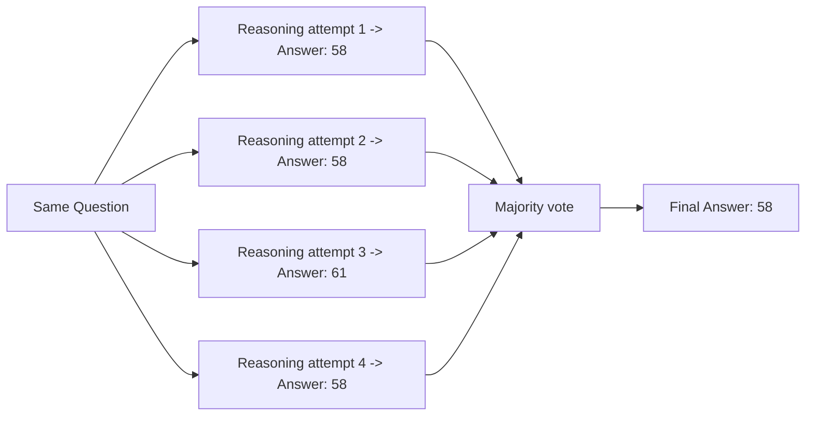
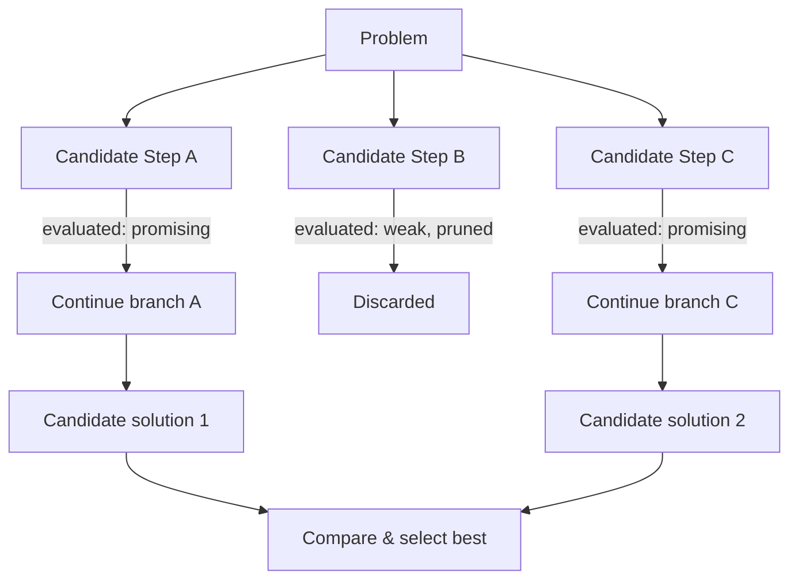

# 7. Self-Consistency & Tree-of-Thought

## Why These Techniques Exist

Chain-of-Thought (Topic 6) gives the model **one** reasoning path. But a single path can still go wrong — the model might take a wrong turn early on and confidently follow it to an incorrect final answer, the same way a person can make one bad assumption early in solving a problem and never notice.

Both techniques in this note address the same underlying problem — **relying on a single reasoning attempt is risky for hard problems** — but they solve it in different ways:



## Self-Consistency

### The Idea

Instead of asking the model for one reasoning chain, you generate **multiple independent chains for the same question** (by sampling the model several times, typically with some randomness/temperature enabled), and then take the **most common final answer** across all of them — like polling several independent solvers and going with the majority verdict.



### Why This Works (Reasoning)

Different sampled attempts at the same problem will sometimes take slightly different reasoning routes — different orderings of steps, different intermediate phrasing. **If a reasoning error is somewhat random/unlucky rather than systematic, most independent attempts will still converge on the same correct answer, while the errors tend to scatter across different wrong answers.** This makes majority voting a surprisingly effective way to filter out one-off mistakes, similar to how averaging multiple independent noisy measurements in engineering reduces the effect of random measurement error.

**Important caveat:** this only helps with *random* errors, not *systematic* ones. If the model has a genuine, consistent misunderstanding of the problem (e.g., it always misreads a specific unit conversion), most or all of its attempts will share that same mistake, and majority voting won't fix it — it'll just confidently confirm the wrong answer more often. Self-consistency is not a substitute for actually verifying the model understood the problem correctly.

### How to Implement It (Developer-Level)

```java
List<String> answers = new ArrayList<>();
for (int i = 0; i < 5; i++) {
    // temperature > 0 introduces variability between calls
    String response = llmClient.call(prompt, /* temperature = */ 0.7);
    answers.add(extractFinalAnswer(response));
}
String majorityAnswer = findMostFrequent(answers);
```

**Reasoning for the temperature setting:** If you call the model 5 times with `temperature = 0` (fully deterministic), you'll typically get the **same reasoning path back every time**, defeating the purpose — there's no diversity to vote across. A moderate temperature is what actually introduces the variety of independent attempts needed for voting to be meaningful.

### Trade-offs (Backed by Reasoning)

| Factor | Cost | Reasoning |
|---|---|---|
| API calls | 3-10x more calls per question | You're literally calling the model multiple times per single user-facing question |
| Latency | Higher, unless parallelized | Multiple sequential calls take longer; running them in parallel (concurrent requests) mitigates this but adds implementation complexity |
| Cost | Directly proportional to number of samples | Every one of those calls is billed — this technique is expensive to run at high volume |

**Practical guidance:** Reserve self-consistency for **high-stakes, low-volume** decisions where correctness matters more than cost/speed (e.g., a critical financial calculation, a one-off data validation step) — not for a high-traffic, low-stakes endpoint like a chat autocomplete.

## Tree-of-Thought (ToT)

### The Idea

Instead of generating a full, linear reasoning chain and only checking the final answer, Tree-of-Thought treats reasoning as **exploring a tree of possible next steps**, where at each step:
1. The model proposes multiple possible "next moves" (not full solutions, just the next step).
2. Each candidate step is evaluated (either by the model itself, or a separate scoring step) for how promising it looks.
3. The most promising branches are kept and expanded further; weak branches are abandoned (pruned) — similar to how a chess engine explores multiple candidate moves and prunes bad ones early, rather than playing out every possible game to the end.



### Why This Matters (Reasoning)

Chain-of-Thought commits to one path from the very first step and never looks back — if step 1 was a poor choice, everything after it inherits that mistake, because standard text generation cannot truly "undo" an earlier token once generated in the same pass. Tree-of-Thought explicitly builds in the ability to **compare alternatives before committing**, and to **abandon a branch that's going nowhere** — much closer to how a person solving a hard puzzle will mentally try an approach, sense it's not working, and backtrack to try something else, rather than committing blindly to the first idea that comes to mind.

### A Simplified Prompt-Level Version

Full Tree-of-Thought is normally implemented as multi-step orchestration code (not a single prompt) — but you can approximate a lightweight version directly in a prompt for simpler cases:

```
Problem: <describe problem>

Propose 3 different possible approaches to solving this problem.
For each approach, briefly evaluate its likelihood of success and
any risks.

Then, based on your evaluation, choose the most promising approach
and work through it in full detail to reach a final answer.
```

**Reasoning for structuring it this way:** Even without full multi-step orchestration, explicitly asking the model to generate *multiple candidate approaches* and *evaluate them before committing* nudges it to behave more like the tree-search process — surfacing and comparing options rather than diving down the first path that comes to mind.

### When to Use Full (Orchestrated) Tree-of-Thought vs. the Simplified Prompt Version

| Situation | Approach | Reasoning |
|---|---|---|
| Task has a genuinely large search space with many valid strategies (e.g., complex planning, puzzle-solving, code architecture decisions) | Full ToT with orchestration code (multiple LLM calls, explicit branch pruning) | The benefit of real backtracking and pruning across many candidate branches justifies the added engineering complexity and cost |
| Task benefits from "consider a few options first" but isn't deeply branching | Simplified single-prompt version shown above | Gets most of the benefit (comparing alternatives before committing) without the cost/complexity of a multi-call orchestration pipeline |
| Task is straightforward, single reasoning path is usually sufficient | Plain CoT (Topic 6) | Adding tree exploration for a task that doesn't need it just adds cost and latency with no measurable benefit |

## Comparing All Three Approaches

| Technique | # of reasoning attempts | How the final answer is chosen | Best for |
|---|---|---|---|
| Chain-of-Thought | 1 | Whatever that single chain concludes | Everyday multi-step reasoning tasks |
| Self-Consistency | Multiple, full independent attempts | Majority vote across final answers | Reducing random errors on well-defined problems (e.g., math) where you can call the model several times cheaply |
| Tree-of-Thought | Multiple, step-by-step with pruning | Best-evaluated branch, expanded and compared | Complex, open-ended problems with many possible strategies, where backtracking mid-reasoning has real value |

## Key Takeaways

- Both techniques exist because a single reasoning chain can quietly go wrong and never self-correct.
- Self-Consistency = run the same prompt multiple times (with some randomness) and take the majority answer — cheap to reason about, but costs multiple full API calls, and only helps with random (not systematic) errors.
- Tree-of-Thought = explore multiple partial reasoning paths, evaluate them, and prune weak ones before committing — closer to how humans backtrack on hard problems, but normally requires actual orchestration code, not just a single prompt.
- Both trade extra cost/latency for higher reliability — reserve them for problems where correctness genuinely justifies the extra spend, not for simple or high-volume/low-stakes tasks.

---
**Next up:** `08-prompt-templates-variables.md` — designing reusable, parameterized prompts for use in real applications.
