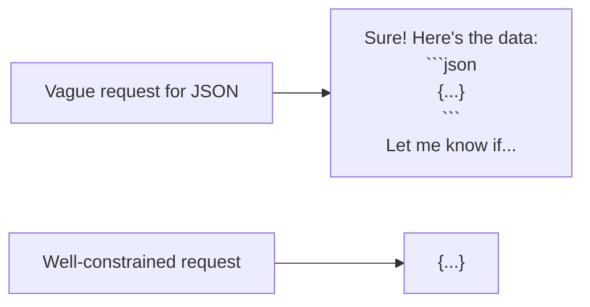

# 9. Structured Output Prompting

## Why This Is One of the Most Important Topics for Developers

Every technique so far has been about getting *better* text out of the model. But when you're integrating an LLM into an application, you usually don't want prose — you want data your code can parse: a JSON object, a specific enum value, a well-formed table. **Structured output prompting** is the discipline of getting the model to reliably produce output in an exact, parseable shape, every time.

This matters enormously in agent-building (your end goal): a ReAct loop (Topic 20) or tool-calling system (Topic 19) is only as reliable as its ability to parse the model's output correctly. If the model wraps its JSON in explanatory prose 1% of the time, that's a production bug waiting to happen.

## The Core Problem

LLMs are trained to be helpful conversational assistants by default. Left unconstrained, they tend to:
- Add a friendly preamble ("Sure! Here's the JSON you asked for:")
- Wrap output in markdown code fences (` ```json ... ``` `)
- Add trailing explanation after the data
- Occasionally produce almost-valid JSON (e.g., trailing commas, unescaped quotes)



None of this is malicious or even wrong from the model's perspective — it's just the model's default "helpful assistant" behavior. Structured output prompting is about **explicitly overriding that default** so the response is machine-parseable.

## Technique 1: Explicit Format Instructions

The most basic approach — just tell the model exactly what you want, and just as importantly, what you *don't* want.

```
Extract the customer's name, order ID, and complaint category from the
message below.

Return ONLY a JSON object with this exact structure, and nothing else —
no explanation, no markdown code fences, no preamble:
{"name": string, "orderId": string, "category": string}

Message: "Hi, this is Raj, order #A4021, the item arrived damaged."
```

**Reasoning for the explicit "nothing else" instruction:** Simply asking for "JSON" is often not enough, because the model's default helpful-assistant training biases it toward adding a wrapper of explanation. Explicitly ruling out the common failure modes (preamble, code fences, trailing commentary) closes off the exact behaviors you're trying to prevent, rather than leaving them merely undiscouraged.

## Technique 2: Provide a Schema

Rather than describing the shape in prose, show the exact schema — this is far less ambiguous, especially for nested or complex structures.

```
Extract information from the support ticket below and return JSON
matching exactly this schema:

{
  "customerName": "string",
  "orderId": "string",
  "issueCategory": "one of: SHIPPING, DEFECT, BILLING, OTHER",
  "urgency": "one of: LOW, MEDIUM, HIGH",
  "requiresRefund": true or false
}

Ticket: "..."
```

**Reasoning:** Showing an explicit schema (including allowed enum values) removes ambiguity that prose descriptions can leave open — e.g., without an explicit enum list, the model might return `"category": "shipping_issue"` in one call and `"category": "Shipping"` in another, both "reasonable" interpretations of a vague instruction, but inconsistent for code that expects one fixed set of values.

## Technique 3: Native Structured Output / Tool-Use Features (The Reliable Way)

Most modern LLM APIs, including Anthropic's, offer a **built-in mechanism** for constrained structured output — rather than relying purely on prompt wording, you define a schema at the API level (similar to defining a function signature), and the API enforces that the model's response conforms to it.

```java
// Conceptual example: defining a "tool" purely to force structured output
Map<String, Object> extractionTool = Map.of(
    "name", "extract_ticket_info",
    "description", "Extracts structured info from a support ticket",
    "input_schema", Map.of(
        "type", "object",
        "properties", Map.of(
            "customerName", Map.of("type", "string"),
            "orderId", Map.of("type", "string"),
            "issueCategory", Map.of(
                "type", "string",
                "enum", List.of("SHIPPING", "DEFECT", "BILLING", "OTHER")
            ),
            "urgency", Map.of(
                "type", "string",
                "enum", List.of("LOW", "MEDIUM", "HIGH")
            )
        ),
        "required", List.of("customerName", "orderId", "issueCategory", "urgency")
    )
);
```

**Reasoning for preferring this over pure prompt-text instructions:** When the schema is enforced at the API/tool level rather than merely requested in the prompt text, the underlying serving infrastructure can constrain the model's generation to only produce tokens that are valid according to the schema (this is sometimes called constrained decoding / grammar-based generation on the provider's side). This is meaningfully more reliable than prompt wording alone, because it isn't just "asking nicely" — it's a structural guarantee enforced outside the model's own discretion. Whenever your provider offers this feature, prefer it over pure text-based formatting instructions for anything production-critical.

> **Note for later:** This exact "tool" mechanism — defining a named function with a schema — is the same underlying feature used for real tool-calling in agents (Topic 19). Structured-output-only "tools" like the example above are essentially a special case: a tool whose only purpose is shaping the response, not performing an external action.

## Technique 4: Delimiters and Tags for Mixed Output

Sometimes you need *both* reasoning/explanation AND structured data in the same response (e.g., you want the model's reasoning for logging/debugging, but your code only parses the final structured part). Use clear delimiters so your code can split the two reliably.

```
Think through your reasoning first. Then output your final answer
between <answer> and </answer> tags as JSON, with nothing else inside
the tags.

<answer>{"category": "DEFECT", "urgency": "HIGH"}</answer>
```

```java
// Extraction in Java
Pattern pattern = Pattern.compile("<answer>(.*?)</answer>", Pattern.DOTALL);
Matcher matcher = pattern.matcher(modelResponse);
if (matcher.find()) {
    String jsonPart = matcher.group(1).trim();
    // parse jsonPart with Jackson/Gson
}
```

**Reasoning:** This connects back to Topic 6 (Chain-of-Thought) — reasoning quality often benefits from letting the model "think out loud," but that same free-form text is exactly what breaks naive JSON parsing. Tag-delimiting gives you the best of both: reasoning quality preserved, and a reliably extractable structured portion for your code.

## Always Parse Defensively — Reasoning for Why

Even with all these techniques, **never assume the model's output will be perfectly well-formed 100% of the time.** Structured output prompting dramatically reduces failure rate — it does not mathematically guarantee zero failures from text-based approaches (native tool-use/schema enforcement, Technique 3, comes closest, but defensive parsing is still good practice).

```java
public Optional<TicketInfo> parseResponse(String rawResponse) {
    try {
        String cleaned = extractBetweenTags(rawResponse, "answer");
        return Optional.of(objectMapper.readValue(cleaned, TicketInfo.class));
    } catch (Exception e) {
        log.warn("Failed to parse structured output: {}", rawResponse, e);
        return Optional.empty();
        // Calling code should have a fallback path here —
        // e.g., retry, fall back to a simpler prompt, or flag for human review.
    }
}
```

**Reasoning:** Treat the LLM the way you'd treat any external, not-fully-under-your-control service (like a third-party API) — wrap calls in proper error handling, never let a malformed response propagate as an unhandled exception into the rest of your system. This mindset becomes essential once you're chaining multiple LLM calls together (Topic 11, Prompt Chaining) or running autonomous agent loops (Topic 20), where one silently malformed output can cascade into much larger downstream failures.

## Comparing the Techniques

| Technique | Reliability | Effort | Best for |
|---|---|---|---|
| Explicit format instructions (prose) | Moderate | Low | Quick prototypes, low-stakes use cases |
| Schema shown in prompt | Good | Low-Medium | Clear communication of exact shape/enums, still low implementation cost |
| Native structured output / tool-use schema | Best | Medium (requires API-level setup) | Anything production-critical, anything parsed automatically downstream |
| Delimiters/tags for mixed reasoning + data | Good, when combined with one of the above | Medium | When you need both reasoning visibility and reliable parsing |

## Key Takeaways

- LLMs default to conversational, prose-wrapped responses — structured output prompting is about deliberately overriding that default.
- Prefer your provider's native structured output/tool-schema feature over pure text instructions whenever the output is production-critical — it's enforced structurally, not just requested.
- When you need both reasoning and structured data, separate them with explicit delimiters/tags rather than trying to parse mixed free-form text.
- Always parse defensively in your application code — treat the model like any external service that can occasionally return something unexpected.
- This topic is foundational for everything in Phase F (agent-building) — tool-calling and ReAct loops are fundamentally structured-output problems at their core.

---
**Next up:** `10-output-formatting-control.md` — controlling length, tone, and style constraints on model output.
