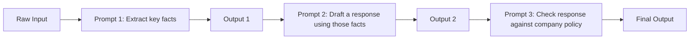
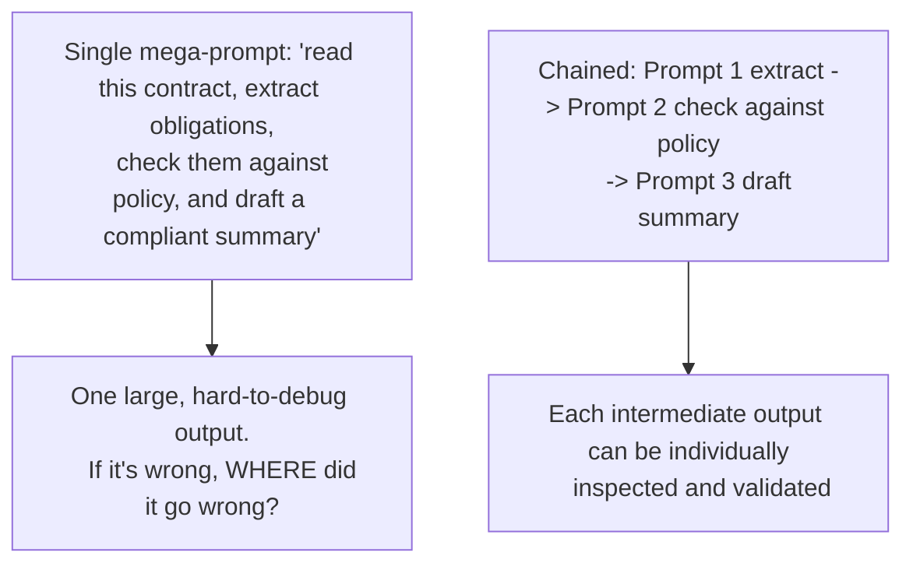

# 11. Prompt Chaining

## The Core Idea

**Prompt chaining** means breaking a complex task into a **sequence of smaller prompts**, where the output of one prompt becomes (part of) the input to the next — instead of trying to accomplish everything in a single, massive prompt.



This is the most direct conceptual bridge between "prompt engineering" and "agent building" — a ReAct loop (Topic 20) and a multi-agent system (Topic 21) are both, fundamentally, elaborate/dynamic forms of prompt chaining. If you understand this topic well, you understand the architectural skeleton of everything that comes in Phase F.

## Why Break a Task Into a Chain (The Reasoning)

### 1. Single-Prompt Tasks Have a Complexity Ceiling

Just like a single, giant method that does five unrelated things is harder to get right than five small, focused methods, a single prompt asking the model to "extract data, reason about it, format it, AND double-check itself" all at once forces the model to juggle multiple competing objectives simultaneously. **Splitting the task lets each individual prompt have one clear job**, which is easier for the model (and you) to get right, debug, and evaluate independently.

### 2. Intermediate Outputs Are Individually Verifiable



**Reasoning:** If a single mega-prompt produces a wrong final answer, you often can't tell *which part* of its internal (opaque) process failed — the extraction, the policy check, or the final drafting. With a chain, each stage's output is an explicit, inspectable artifact — you can log it, unit test it, and pinpoint exactly which stage introduced an error. This is directly analogous to why you'd rather debug a multi-step data pipeline with logged intermediate results than one giant unobservable function.

### 3. Different Stages Can Use Different Settings or Even Different Models

Because each step in a chain is a separate API call, you have full control over each one independently:

| Stage | Might need | Reasoning |
|---|---|---|
| Extraction (facts from raw text) | Low temperature, no creativity needed | You want consistent, literal extraction, not creative variation |
| Draft generation | Higher temperature, more natural language variety | Generative, human-facing text benefits from more natural phrasing |
| Policy/compliance check | A different, perhaps smaller/cheaper model, very low temperature | This step is closer to classification/verification — doesn't need your most expensive model, and consistency matters most |

**Reasoning:** A single mega-prompt forces you into one setting (one temperature, one model) for a task that might actually have very different needs at different stages. Chaining lets you tune each stage independently, which can improve both quality and cost-efficiency.

## A Concrete Example: Customer Support Email Pipeline

**Without chaining (single mega-prompt):**
```
Read this customer email, identify their issue and sentiment, check
if it violates any refund policy, and write a complete, policy-
compliant, empathetic response.

Email: <email text>
```
This asks the model to do extraction, policy reasoning, and generation all in one pass — errors in any part are hard to isolate.

**With chaining:**

```
Step 1 - Extraction prompt:
"Extract the customer's core issue, sentiment (POSITIVE/NEUTRAL/
NEGATIVE), and whether a refund is being requested. Return as JSON."
-> Output: {"issue": "damaged item", "sentiment": "NEGATIVE",
            "refundRequested": true}

Step 2 - Policy check prompt (using Step 1's output as input):
"Given this refund request: {issue, sentiment, refundRequested},
and our policy (refunds allowed within 30 days for damaged items),
determine if this refund should be approved. Return APPROVED or
DENIED with a one-line reason."
-> Output: "APPROVED - damaged item, within policy window"

Step 3 - Drafting prompt (using Steps 1 and 2's output as input):
"Write an empathetic customer support email. The customer's issue
was: {issue}. Their refund request was: {policy decision from Step 2}.
Tone: warm but professional. Max 4 sentences."
-> Output: Final email text
```

```java
// Java pseudocode showing the chain
ExtractionResult extraction = llm.call(extractionPrompt(email), ExtractionResult.class);
PolicyDecision decision = llm.call(policyPrompt(extraction), PolicyDecision.class);
String finalEmail = llm.call(draftingPrompt(extraction, decision));
```

**Reasoning for this specific chain design:** Each step has a single, narrow responsibility — extraction, then policy reasoning, then generation — mirroring the single-responsibility principle you already apply when designing service classes. This also means you could unit-test the policy-check step in isolation with a variety of synthetic `ExtractionResult` inputs, without needing a real customer email or invoking the whole pipeline — exactly like unit testing one method in a larger call stack.

## Chaining vs. One Big Prompt — When to Use Which

| Situation | Recommended approach | Reasoning |
|---|---|---|
| Task has 2+ genuinely distinct sub-tasks (extract, then decide, then generate) | Chain | Each sub-task benefits from focused instructions and independent verifiability |
| Task is a single, well-defined transformation (e.g., "translate this sentence") | Single prompt | No natural sub-steps exist; chaining would just add latency/cost with no benefit |
| You need to audit/log intermediate reasoning for compliance or debugging | Chain | Chaining produces natural, inspectable checkpoints; a single prompt's internal process is opaque |
| Latency is extremely critical (e.g., real-time chat) | Prefer single prompt if quality allows | Each chain step is a full network round-trip — chaining directly adds latency, since steps often must run sequentially |

## The Trade-off: Latency and Cost (Backed by Reasoning)

Chaining is not free — this is the same self-consistency (Topic 7) trade-off pattern reappearing: more calls means more cost and more latency.

**Reasoning:** Each stage in a chain is a separate network round-trip to the LLM API. If Step 2 depends on Step 1's output, these calls typically must happen **sequentially**, not in parallel — so a 3-step chain could easily take 3x the latency of a single call. This is a real architectural cost, and it's why you shouldn't chain reflexively for every task — only when the reliability/debuggability benefit (from the reasoning above) genuinely outweighs the added latency for your specific use case.

## Error Handling Across a Chain

Because a chain has multiple steps, a failure partway through needs a clear strategy — don't let a mid-chain failure silently corrupt the final output.

```java
Optional<ExtractionResult> extraction = tryExtract(email);
if (extraction.isEmpty()) {
    // Decide: retry with a different prompt? Fall back to a default?
    // Escalate to a human review queue? Never silently proceed with null data.
    return fallbackResponse();
}
```

**Reasoning:** If Step 1 (extraction) silently fails or returns malformed data, and your code naively passes that broken output into Step 2 (policy check), you get a cascading failure — Step 2 will now reason about garbage input, and Step 3 will draft a response based on a garbage decision. Just as you'd never let a corrupted intermediate result silently flow through a data pipeline in traditional software, validate and handle failure at every chain boundary explicitly. This exact discipline becomes critical in Topic 20 (ReAct Prompting), where chains become loops that can run many iterations — an unhandled error early on can compound across many subsequent steps.

## Key Takeaways

- Prompt chaining splits a complex task into a sequence of smaller, single-purpose prompts, where each step's output feeds the next.
- The core benefits are: each step is individually debuggable/verifiable, each step can use independently tuned settings (or even different models), and failures are easier to isolate.
- The core cost is added latency and API calls, since chained steps are usually sequential (not parallelizable) when one depends on the previous one's output.
- Always validate output at each chain boundary defensively — an unhandled failure in an early step will silently corrupt every step after it.
- This topic is the conceptual foundation for agent loops and multi-agent orchestration (Phase F) — think of ReAct and multi-agent systems as dynamic, conditional chains rather than an entirely new concept.

---
This completes **Phase C: Structuring Output**. Next: `12-prompt-evaluation-testing.md`, the first topic of **Phase D: Reliability & Safety**.
