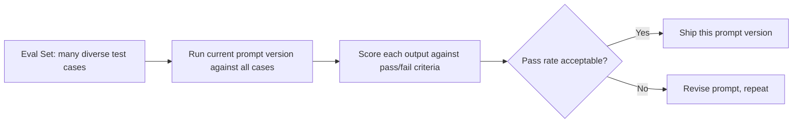
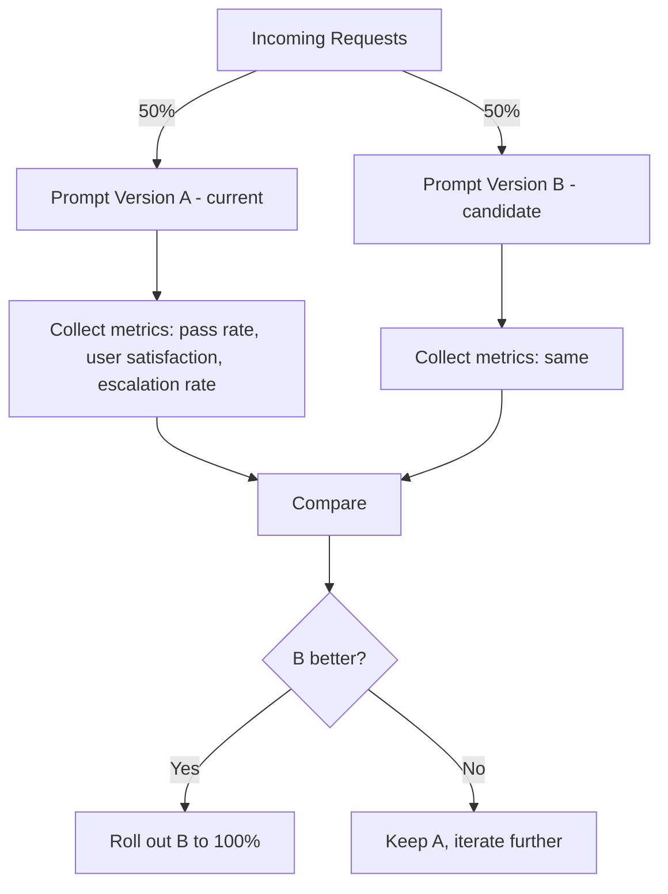

# 12. Prompt Evaluation & Testing

## Why This Topic Is Non-Negotiable for Production Systems

Everything covered so far (roles, examples, chain-of-thought, structured output, chaining) is about **writing** good prompts. This topic is about **knowing whether a prompt actually works** — reliably, across many inputs, over time — which is a completely different skill. As a software developer, think of this as the direct analog of testing: you wouldn't ship code without tests, and you shouldn't ship a prompt without evaluation.

**The core problem this topic solves:** a prompt that produces a great answer for the one example you tried while writing it can still fail silently on 15% of real-world inputs. Without systematic evaluation, you simply won't know that until users hit it in production.

## Why "It Worked When I Tried It" Is Not Enough (Reasoning)

LLM output is **probabilistic and input-sensitive** (Topic 1). This has a direct consequence for testing:

- A prompt might work perfectly on the 3-5 examples you manually tried while developing it, but fail on edge cases you didn't think to try — long inputs, oddly formatted inputs, inputs in a different language, ambiguous inputs.
- Even the *same* input can occasionally produce different output across calls (especially with non-zero temperature), so a single successful test run doesn't guarantee consistent behavior.
- Small prompt tweaks made later (to fix one issue) can silently break behavior on inputs that were previously working — this is the LLM equivalent of a regression bug.

**Reasoning:** Just as you wouldn't trust a piece of code was correct just because it worked once in a manual REPL test, you shouldn't trust a prompt is production-ready just because it worked on a couple of manual attempts. You need a **repeatable test suite**, run against a fixed set of inputs, checked against clear pass/fail criteria — exactly the discipline of unit/integration testing, applied to prompts.

## Building an Evaluation Set ("Eval Set")

An eval set is a curated collection of **input/expected-output pairs** (or at least input + criteria for a "good" output) that you run your prompt against every time you change it — directly analogous to a regression test suite.



### What to Include in Your Eval Set (With Reasoning)

| Case type | Example | Reasoning for including it |
|---|---|---|
| Typical/happy-path inputs | A well-formed, average-length customer email | Confirms the prompt handles the common case — your baseline |
| Edge cases | An empty message, a message in all caps, a very long message | Real-world input is messy; if you don't test these deliberately, you'll discover failures in production instead |
| Ambiguous inputs | A message that could be classified two different ways | Reveals how the model resolves genuine ambiguity — helps you decide if you need clearer instructions or examples (Topic 3) |
| Adversarial/malicious inputs | A message attempting prompt injection (Topic 13) | Confirms your guardrails actually hold, not just that the "nice" cases work |
| Known previous failures | Any input that broke a prior prompt version | Prevents regressions — the same reasoning behind keeping regression tests for fixed bugs in normal code |

**Reasoning for prioritizing diversity over volume:** A 200-case eval set that's 190 near-duplicate "happy path" examples and 10 edge cases tells you far less than a 40-case set deliberately spread across categories above. The goal is coverage of *behavior types*, not raw count — this mirrors the same "diversity over quantity" reasoning from Topic 3 (few-shot examples).

## Scoring Methods

### 1. Exact Match (for narrow, deterministic tasks)
```java
boolean passed = actualOutput.trim().equals(expectedOutput.trim());
```
**When this works (reasoning):** Only appropriate for tasks with one genuinely correct answer, like classification into a fixed enum ("POSITIVE"/"NEGATIVE"/"NEUTRAL") or structured field extraction. For open-ended generation (a support email reply), exact match is far too strict — two differently-worded but equally good responses would both "fail," making this scoring method actively misleading for generative tasks.

### 2. Rule-Based / Programmatic Checks
```java
boolean passed = actualOutput.length() <= 300
    && actualOutput.contains("refund")
    && !actualOutput.toLowerCase().contains("guarantee"); // e.g., banned word for legal reasons
```
**Reasoning:** For generative tasks, you often can't check for one exact string, but you *can* check for necessary properties: length limits, required keywords, absence of banned terms, valid JSON structure. This is a middle ground — more flexible than exact match, but still fully automatable and deterministic, unlike the next method.

### 3. LLM-as-a-Judge
Use a **separate LLM call** to *evaluate* the quality of the first model's output against criteria you specify:
```
You are evaluating a customer support response for quality.

Original customer message: {message}
Generated response: {response}

Rate the response on a scale of 1-5 for:
1. Empathy
2. Accuracy (does it correctly address the stated issue?)
3. Policy compliance (does it avoid promising anything outside
   standard refund policy?)

Return as JSON: {"empathy": n, "accuracy": n, "policy_compliance": n}
```
**Reasoning for using this technique:** Many qualities that matter (tone, empathy, helpfulness) are inherently subjective and don't reduce to a simple rule-based check — but a human manually reading and rating hundreds of outputs on every prompt change doesn't scale. Using a separate LLM call as an automated "judge" against explicit criteria gives you a scalable proxy for human judgment. It is not perfectly reliable (the judge model can itself be wrong or inconsistent) — treat LLM-as-judge scores as a strong *signal*, not absolute ground truth, and periodically spot-check its ratings against real human judgment to confirm it's calibrated well.

### 4. Human Review (the ground truth, used sparingly)
Reserve manual human review for: validating that your automated scoring methods (rule-based checks, LLM-judge) are actually well-calibrated, and for spot-checking a sample of production outputs periodically.

**Reasoning:** Human review is the most trustworthy signal but doesn't scale to every prompt iteration or every production request — use it as your periodic "ground truth check" on the automated methods, not as your primary day-to-day testing loop.

## A/B Testing Prompt Versions

Once you have two candidate prompt versions (e.g., current production prompt vs. a revised one), you can test them head-to-head — either offline against your eval set, or online with real traffic split between versions.



**Reasoning for online A/B testing in addition to offline eval sets:** Your eval set, however carefully built, is still a curated approximation of real-world input distribution — it can miss patterns present in actual live traffic. Online A/B testing with real (but limited-percentage, risk-controlled) traffic validates that gains seen on your eval set actually translate to real-world improvement, the same way you might canary-deploy a risky code change to a small percentage of production traffic before a full rollout, rather than trusting staging-environment tests alone.

## Continuous Evaluation — Not Just a One-Time Check

**Reasoning for why this needs to be ongoing, not a one-off gate:**
- Model providers periodically update or deprecate model versions — the exact same prompt can behave differently on a new model version than it did before, so a prompt that passed evaluation months ago isn't guaranteed to still perform the same today.
- Real-world input distributions shift over time (e.g., new slang, new product lines, new types of customer complaints) — an eval set built a year ago may no longer reflect what's actually coming in.
- Every prompt change (even a "small" wording tweak) should re-run against the full eval set before shipping — this is the direct parallel to running your full regression test suite before every deploy, not just before major releases.

**Practical setup for developers:** Treat your eval set the same way you treat a CI test suite — store it in version control alongside your prompt templates (Topic 8), and run it automatically whenever a prompt or template file changes, ideally as part of your existing CI/CD pipeline.

## Key Takeaways

- A prompt working on a few manual examples during development is not evidence it will work reliably in production — you need a proper eval set, run systematically, just like unit/regression tests for code.
- Build your eval set for *diversity* of case types (happy path, edge cases, ambiguous, adversarial, known past failures) rather than sheer volume.
- Choose scoring methods appropriate to the task: exact match for narrow/deterministic tasks, rule-based checks for verifiable properties, LLM-as-a-judge for subjective qualities at scale, and human review as your periodic calibration check.
- A/B test prompt changes with real traffic in addition to offline eval sets, since real-world input distributions can differ from your curated test cases.
- Evaluation is continuous, not a one-time gate — model updates and shifting real-world input both mean a prompt that passed before isn't guaranteed to keep passing; wire your eval set into CI/CD the same way you would any other regression suite.

---
**Next up:** `13-guardrails-prompt-injection-defense.md` — protecting your system against malicious or manipulative input.
