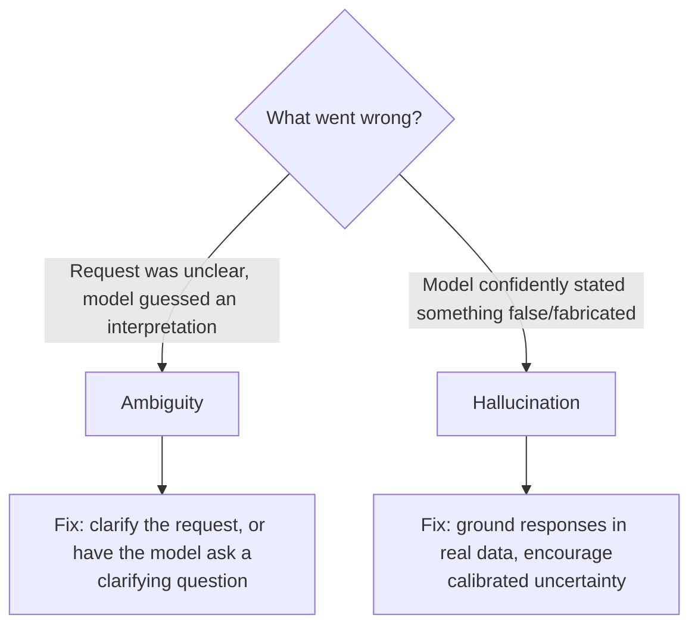

# 14. Handling Ambiguity & Hallucination Mitigation

## Two Related but Distinct Problems

This topic covers two failure modes that often get conflated but have different causes and different fixes:

1. **Ambiguity** — the request itself is unclear or underspecified, so there are multiple reasonable interpretations, and the model has to guess which one you meant.
2. **Hallucination** — the model states something false, fabricated, or unsupported **with full confidence**, as if it were a verified fact.



## Part 1: Handling Ambiguity

### Why Ambiguity Happens
An LLM cannot ask you a follow-up question unless you explicitly design your system to allow that — by default, most single-turn API integrations force the model to produce *some* answer immediately, even when the input genuinely under-specifies what's wanted. The model then has to silently pick one interpretation and commit to it, without telling you it had to guess.

**Example of a silently ambiguous request:**
```
"Can you look into the issue with the report?"
```
Which report? What kind of "issue"? The model will have to invent an interpretation, and it won't necessarily flag that it's guessing — this is functionally similar to an API endpoint that silently defaults missing parameters instead of returning a 400 Bad Request; the caller gets *some* response, but not necessarily the right one.

### Technique 1: Explicitly Allow Clarifying Questions

```
If the request below is ambiguous or missing information you need to
proceed correctly, ask a clarifying question instead of guessing.
Otherwise, proceed directly with your best answer.

Request: "Can you look into the issue with the report?"
```

**Reasoning:** By default, models are trained to be maximally helpful and will often try to answer *something* rather than push back — explicitly permitting (and instructing) a clarifying question overrides that default bias toward guessing, closing the exact gap that causes silent misinterpretation. This is directly relevant to conversational applications (a chatbot) but often needs to be *disabled* for automated pipeline stages (see below).

### Technique 2: State Assumptions Explicitly Instead of Silently Guessing

For automated/pipeline contexts where asking a clarifying question isn't practical (e.g., a batch job processing thousands of records with no human in the loop), a middle ground is to have the model **state its assumption out loud** rather than silently picking one.

```
If any part of this request is ambiguous, explicitly state the
assumption you're making before answering, so it can be reviewed.
```

**Reasoning:** In a fully automated pipeline, you often can't pause and wait for a human's clarifying answer — but you also don't want a silent, unreviewable guess. Having the model surface its assumption explicitly gives you (or downstream logging/review) visibility into exactly where it had to fill a gap, which is invaluable for debugging why a batch output turned out unexpected, and directly supports the eval-set practice from Topic 12 (you can specifically check whether stated assumptions match your intent).

### Technique 3: Reduce Ambiguity Upstream, at the Prompt Design Level

The most robust fix is often not a runtime technique at all, but simply applying Topic 2's structure (Role, Context, Instruction, Constraints, Output Format) more rigorously in the first place — much ambiguity is really just underspecification that a more complete prompt template would have already prevented.

**Reasoning:** Every ambiguity you catch and fix at prompt-design time is one you don't need a runtime clarifying-question mechanism to handle at all — this is the same "prevent bugs at compile time rather than catch them at runtime" instinct applied to prompt design.

## Part 2: Hallucination Mitigation

### Why Hallucination Happens (Reasoning)
An LLM generates text by predicting the statistically most likely next token, based on patterns learned during training — it does not have a built-in, separate "fact-checking" module that verifies claims against a ground-truth database before producing them. When the model doesn't actually have reliable information about something (a very recent event, a very obscure fact, a specific number it never truly "knew"), it can still generate fluent, confident-sounding text, because fluency and confidence in phrasing are a property of *how* the text is generated, not evidence that the underlying claim is actually true. This is the core reason hallucination is a fundamentally different problem from a normal "bug" — the model isn't malfunctioning when it hallucinates; it's doing exactly what it's built to do (predict plausible continuations), just without the guarantee that "plausible" always means "true."

### Technique 1: Ground Responses in Provided Data (Retrieval)

The single most effective mitigation: **don't ask the model to recall facts from memory when you can instead give it the actual source data directly in the prompt** and ask it to answer *based on that data only*.

```
Answer the question using ONLY the information in the document below.
If the document does not contain the answer, say "This information
is not available in the provided document" rather than guessing.

Document: {{retrieved_document_text}}

Question: {{user_question}}
```

**Reasoning:** This shifts the task from "recall a fact from training" (where hallucination risk is highest) to "extract/summarize from provided text" (a task LLMs are much more reliable at, since the actual answer is right there in the context rather than needing to be recalled from parametric memory). This exact pattern — providing real source documents instead of relying on the model's memorized knowledge — is the entire foundation of Retrieval-Augmented Generation, covered in full in Topic 18. If you remember one fix for hallucination above all others, it's this one.

### Technique 2: Explicitly Permit (and Reward) "I Don't Know"

```
If you are not confident in the accuracy of a specific fact, say so
explicitly rather than stating it as certain. It is better to say
"I'm not certain about this" than to state something incorrect
confidently.
```

**Reasoning:** Without this explicit permission, models often default toward producing a confident-sounding answer, because that's a common pattern in the confident, authoritative writing they were trained on — fluent, assertive text is simply a more common training pattern than hedged uncertainty. Explicitly instructing the model that hedging is the *correct and desired* behavior in uncertain cases directly counteracts that default bias.

### Technique 3: Ask for Citations/Sources Within Provided Context

```
Answer using only the provided context below. For each claim in your
answer, note which part of the context it came from.
```

**Reasoning:** Requiring the model to trace each claim back to a specific part of the provided source material makes fabrication more visible and checkable — if a claim can't be tied back to any part of the actual source, that's a strong, checkable signal to your reviewers (human or automated eval, Topic 12) that it may be fabricated, rather than a hallucination hiding invisibly inside otherwise-plausible prose.

### Technique 4: Lower Temperature for Factual Tasks

```java
// Factual extraction/QA: lower temperature reduces creative variation
llm.call(prompt, /* temperature = */ 0.0);

// Creative writing: higher temperature is fine and often desirable
llm.call(creativePrompt, /* temperature = */ 0.8);
```

**Reasoning:** Temperature controls how much randomness is introduced into the model's next-token selection. For tasks where there's one correct factual answer, higher temperature adds unnecessary variability that can push the model toward less-likely (and less accurate) token choices. Lowering it doesn't guarantee elimination of hallucination (a model can be perfectly deterministic and still confidently wrong if the underlying knowledge itself is flawed or absent), but it removes an unnecessary *additional* source of variance on top of that risk.

### Technique 5: Independent Verification for High-Stakes Claims

For genuinely high-stakes outputs (medical, legal, financial claims, anything a downstream automated system will act on without human review), don't rely on prompt wording alone — add a **separate verification step**, similar in spirit to prompt chaining (Topic 11):

```
Step 1: Generate the answer.
Step 2 (separate call): "Review the following answer for factual
accuracy against the provided source document. Flag any claim that
is not directly supported by the document."
```

**Reasoning:** A second, independent pass specifically tasked with verification (rather than generation) sometimes catches errors the first pass missed, similar to how a code reviewer catches bugs the original author didn't notice — not because the reviewer is a fundamentally different kind of system, but because a fresh, narrowly-focused pass has different failure characteristics than the original generative pass. This is not foolproof (the verification model can itself make mistakes), but it's a meaningfully additional layer of defense for cases where correctness genuinely matters.

## Ambiguity and Hallucination Interact

Notice that these two problems often compound: an **ambiguous request** increases the chance of a **hallucinated answer**, because when the model has to silently guess at your intent, it's also more likely to fill in unstated details with plausible-sounding fabrication rather than flagging the gap. Fixing ambiguity upstream (Part 1 techniques) therefore also indirectly reduces hallucination risk — they aren't fully separate problems in practice, even though it's useful to reason about them separately when designing mitigations.

## Key Takeaways

- Ambiguity and hallucination are related but distinct: ambiguity is about unclear *requests*; hallucination is about false *confident claims*.
- For ambiguity: explicitly permit clarifying questions in conversational contexts, or have the model state assumptions explicitly in automated/pipeline contexts — never let it silently guess without visibility.
- For hallucination: the single most effective fix is grounding answers in provided source data (retrieval) rather than relying on the model's memorized training knowledge — this is the foundation of RAG (Topic 18).
- Explicitly permit and reward "I don't know" responses, since models default toward confident-sounding phrasing due to training patterns, not because they've actually verified the claim.
- For high-stakes outputs, add an independent verification step rather than trusting a single generative pass — treat this the same way you'd value an independent code reviewer catching what the original author missed.
- Reducing ambiguity upstream in your prompt design (Topic 2) often prevents hallucination downstream too — the two problems compound in practice.

---
This completes **Phase D: Reliability & Safety**. Next: `15-meta-prompting.md`, the first topic of **Phase E: Advanced Techniques**.
