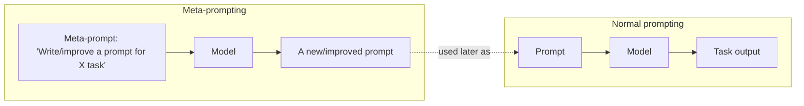
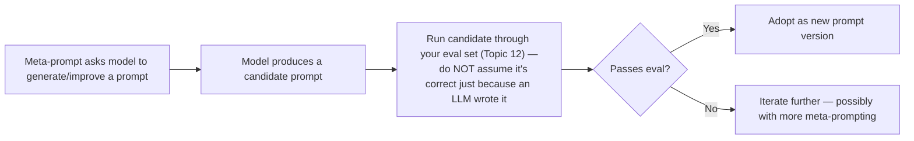

# 15. Meta-Prompting

## The Core Idea

**Meta-prompting** means using an LLM to **write, critique, or improve prompts** — instead of (or in addition to) using it to complete the end task directly. You're pointing the model at the prompt itself as the "subject," rather than at the underlying business task.



**Developer analogy:** This is similar to using a code generator or linter that writes/improves *other code* rather than solving the business problem directly — you're one level of abstraction up, working on the tool that will do the work, not the work itself.

## Why This Is Useful (Reasoning)

### 1. Prompt Writing Is Itself a Skill With a Learning Curve
Everything in Topics 1-14 shows that good prompting requires knowing specific techniques (roles, constraints, CoT, structured output, etc.) and applying them well. Not everyone on a team — a product manager writing the first draft of a support-bot prompt, for instance — has internalized all of that. **Reasoning:** Using the model itself to draft or refine a prompt lets you leverage the model's own trained knowledge of "what makes prompts work well" as a starting point, rather than requiring every prompt author to be a prompt-engineering expert from scratch.

### 2. Self-Critique Can Surface Issues You Didn't Notice
```
Here is a prompt I've written for a customer support classification
task: {{prompt_text}}

Review this prompt for: ambiguity, missing constraints, unclear
output format requirements, and edge cases it might fail to handle.
Suggest specific improvements.
```
**Reasoning:** Just as a second pair of eyes reviewing your code often catches issues you were too close to notice yourself, using the model to critique its own type of input (a prompt) can surface ambiguities or missing constraints you didn't think to check for — informed by the same patterns the model has seen across countless other prompts during training.

### 3. Rapid Iteration Without Manual Rewriting
Instead of manually rewriting a prompt every time you spot an issue, you can describe the *problem* you're seeing in the output, and have the model propose the *fix* to the prompt directly.

```
This prompt: {{current_prompt}}
...is producing outputs that are too verbose and sometimes include
disclaimers we didn't ask for.

Rewrite the prompt to fix these specific issues while preserving its
original intent.
```

**Reasoning:** This turns prompt iteration into a faster feedback loop — you supply the observed *symptom*, the model proposes the *prompt-level fix* — rather than you manually diagnosing exactly which wording change would address the issue every single time.

## Meta-Prompting Patterns

### Pattern 1: Prompt Generation from a Task Description

```
I need a prompt for the following task: classify incoming support
tickets into categories (BILLING, TECHNICAL, SHIPPING, OTHER) and
determine urgency (LOW, MEDIUM, HIGH).

The output will be parsed by application code, so it needs to be
strict JSON.

Write a complete, production-ready prompt for this task, including
role, instructions, output schema, and constraints against common
failure modes for this type of task.
```

**Reasoning:** This treats the model as a prompt-engineering assistant that already knows the structural best practices from Topic 2 (role, instruction, constraints, output format) — you supply the task-specific requirements, and it assembles them into a well-formed prompt, similar to how a code-generation tool can scaffold boilerplate from a high-level spec, leaving you to review and refine rather than start from a blank file.

### Pattern 2: Prompt Critique/Review

```
Review the following prompt as an expert prompt engineer. Identify:
1. Any ambiguous instructions.
2. Missing constraints that could lead to unwanted output.
3. Whether the output format is precisely specified enough to be
   reliably parsed by code.

Prompt to review:
{{prompt_text}}
```

**Reasoning:** This is essentially a code-review pattern applied to prompts — asking for a structured critique against specific criteria (ambiguity, missing constraints, parseability) rather than a vague "is this good?" gets you actionable, specific feedback, the same way a good code review checklist beats an open-ended "does this look ok?" ask.

### Pattern 3: Prompt Rewriting for a Specific Fix

```
Current prompt: {{prompt_text}}

Observed issue: the model sometimes returns markdown code fences
around the JSON output, breaking our parser.

Rewrite the prompt to eliminate this specific issue, without changing
anything else about its behavior.
```

**Reasoning for constraining the rewrite ("without changing anything else"):** Without this constraint, a rewrite could unintentionally alter other behaviors that were already working correctly — the same risk as an overly broad code refactor introducing unrelated regressions. Scoping the requested change narrowly (fix this one specific issue, preserve everything else) reduces the risk of the "fix" introducing new problems elsewhere.

## Meta-Prompting for Chain and Template Design

Meta-prompting isn't limited to single prompts — you can also use it to help design an entire prompt chain (Topic 11) or template structure (Topic 8):

```
I need to build a pipeline that processes a customer email and
produces a policy-compliant support response. Break this into a
sequence of 2-4 focused prompts (a prompt chain), and describe what
each step's input and output should be.
```

**Reasoning:** Designing a good chain requires the same "single responsibility per step" reasoning discussed in Topic 11 — using meta-prompting here means leveraging the model's broad exposure to how such pipelines are typically structured, giving you a solid starting architecture to refine rather than designing the whole chain from a blank slate.

## Important Caveat: Meta-Prompting Output Still Needs Evaluation

**This is the most important reasoning point in this topic.** A prompt generated or "improved" by an LLM is not automatically correct or optimal just because an LLM produced it — it is still, fundamentally, a first draft that must go through the exact same evaluation discipline from Topic 12.



**Reasoning:** The model generating the prompt has no special, guaranteed insight into your exact production requirements, edge cases, or eval criteria unless you've explicitly communicated all of that in the meta-prompt itself — and even then, it's still subject to all the same reliability limitations (Topic 14) as any other LLM output. Treat meta-prompting as an accelerant for the *drafting* phase of prompt engineering, never as a substitute for the *testing* phase.

## When Meta-Prompting Is Most Valuable (Practical Guidance)

| Situation | Value of meta-prompting | Reasoning |
|---|---|---|
| Starting a new prompt from scratch for a well-understood task type | High | Gives you a strong first draft instantly, informed by common patterns, instead of starting from a blank page |
| Debugging a specific, well-characterized failure mode | High | You can describe the exact symptom and get a targeted fix suggestion, similar to describing a bug to a colleague and asking for a proposed patch |
| Designing an entirely novel prompt architecture for a highly unusual, domain-specific task | Moderate | The model's suggestions are still worth reviewing, but domain-specific nuances may need more manual judgment since the model has less directly relevant pattern exposure |
| Final sign-off / production readiness decision | Low — this step should never be automated away | Regardless of how a candidate prompt was produced, it must pass your evaluation process (Topic 12) before shipping — meta-prompting only helps you get to a better *candidate* faster |

## Key Takeaways

- Meta-prompting means using an LLM to generate, critique, or refine prompts themselves, not just to perform the end task — pointing the model at the "prompt" as the subject.
- It's valuable for rapid drafting, structured self-critique, and designing prompt chains, especially when you're less familiar with prompt-engineering best practices yourself or want to move faster.
- Meta-prompting output is a first draft, not a verified final artifact — always run generated/revised prompts through your evaluation process (Topic 12) before adopting them, exactly as you would any other prompt.
- Treat this technique as an accelerant for drafting, never a substitute for testing and review.

---
**Next up:** `16-automatic-prompt-optimization.md` — systematic, often algorithmic approaches to refining prompts based on measured performance.
