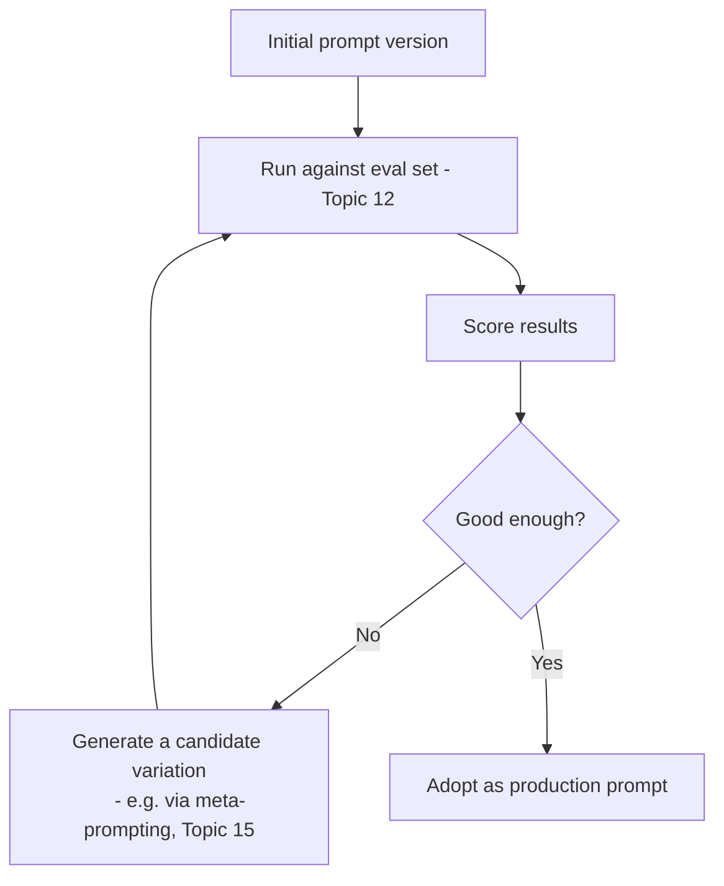
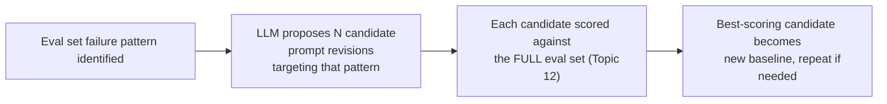

# 16. Automatic Prompt Optimization

## How This Differs From Meta-Prompting (Topic 15)

Meta-prompting (Topic 15) is fundamentally **manual and ad hoc** — you, the developer, decide when to ask the model to draft or fix a prompt, and you review each suggestion yourself. **Automatic prompt optimization** is about building (or using) a **systematic, often looped process** that iteratively improves a prompt against your eval set (Topic 12) — closer to a hyperparameter search or an optimization loop in traditional ML than a one-off "please improve this" request.



**Developer analogy:** This is the prompt-engineering equivalent of automated hyperparameter tuning (e.g., grid search or Bayesian optimization for a machine learning model) — instead of a human manually trying a few configurations by hand, a systematic process explores a search space and evaluates against a fixed metric, iterating automatically or semi-automatically.

## Why Automate This (Reasoning)

- **Manual iteration doesn't scale well** to a large number of small wording variations — a human can realistically try a handful of prompt variants and compare results, but a systematic loop can try dozens or hundreds of variations, testing combinations a human might not think to try.
- **Human intuition about wording is imperfect and inconsistent.** Two developers might disagree about which of two phrasings is "clearer," while an eval-set-based score gives an objective, repeatable measure to optimize against — removing subjective disagreement from the loop.
- **It formalizes the same discipline from Topic 12** (never trust "it seemed fine when I tried it") by directly wiring a scoring loop into the optimization process itself, rather than relying on a human to remember to re-test after every change.

## Approach 1: Manual-But-Systematic Grid Search

Even without special tooling, you can apply the same *spirit* as automatic optimization by hand, in a disciplined way:

```java
List<String> promptVariants = List.of(
    promptVariantA,  // e.g., with explicit "think step by step"
    promptVariantB,  // e.g., with a stricter output-format instruction
    promptVariantC   // e.g., with an added negative example
);

for (String variant : promptVariants) {
    double score = evaluateAgainstEvalSet(variant, evalSet);
    log.info("Variant scored: {}", score);
}
// Adopt the highest-scoring variant, or combine insights from multiple
```

**Reasoning:** This is "automatic" in spirit (systematic, scored, repeatable) even without any specialized optimization library — the important shift from Topic 15 is that you're not just asking a model "is this better?" once; you're running every candidate through the exact same objective eval set and comparing scores directly, removing guesswork from the comparison.

## Approach 2: LLM-Driven Iterative Refinement Loop

You can combine meta-prompting (Topic 15) with evaluation (Topic 12) into a semi-automated loop: use an LLM to *propose* variations, but always score them against your real eval set rather than trusting the LLM's own opinion of whether the variation is better.

```
Given this prompt: {{current_prompt}}

And this evaluation feedback: "Failed 4 out of 20 test cases —
specifically, cases involving ambiguous refund requests were
classified inconsistently."

Propose 3 different revised versions of the prompt that might fix
this specific failure pattern.
```

Each of the 3 candidates then gets run through the **actual eval set** (not just judged by the model's own opinion) to see which genuinely improves the pass rate.



**Reasoning for scoring against the full eval set, not just the failing cases:** A revision targeted narrowly at fixing one specific failure pattern can sometimes fix that pattern while accidentally breaking previously-passing cases — this is the prompt-engineering equivalent of a code fix that resolves one bug but introduces a regression elsewhere. Always re-run the **complete** eval set after any change, never just the subset you were trying to fix, exactly as you would run your full regression suite after a targeted code fix, not just the specific test that was previously failing.

## Approach 3: Dedicated Prompt Optimization Tools/Frameworks

There is a growing ecosystem of frameworks (e.g., DSPy and similar libraries) specifically designed to formalize this optimization loop — you define your task, your scoring metric, and a set of training examples, and the framework automatically searches over prompt phrasings, few-shot example selections, and instruction wording to maximize your metric, often using techniques inspired by traditional ML optimization.

**Reasoning for being aware of these tools without needing deep expertise yet:** As you move further into building production agent systems (your Phase 2-4 roadmap), knowing that this category of tooling exists means you won't have to manually reinvent iterative prompt optimization from scratch when the need arises — you can adopt an existing framework rather than build your own optimization loop from zero. For now, understanding the *underlying loop* (score against eval set, generate variations, compare, repeat) matters more than mastering any one specific tool, since the tooling landscape in this space is evolving quickly.

## What Gets Optimized in Practice

Automatic prompt optimization can search over several different "dimensions" of a prompt, not just the wording of instructions:

| Dimension | What's varied | Example |
|---|---|---|
| Instruction phrasing | Different ways of stating the same task | "Classify the sentiment" vs. "Determine whether the tone is positive, negative, or neutral" |
| Few-shot example selection (Topic 3) | Which specific examples to include, and how many | Testing whether 2 vs. 4 examples, or different example combinations, perform better |
| Example ordering | The sequence in which few-shot examples appear | Testing whether putting the hardest example last (recency effect, mentioned in Topic 3) helps or hurts |
| CoT instruction presence/wording (Topic 6) | Whether/how "think step by step" is phrased | Testing zero-shot CoT vs. no CoT at all, for tasks where it's unclear upfront which will perform better |
| Output format instruction strictness (Topic 9) | How explicitly format constraints are stated | Testing whether adding "nothing else" reduces malformed output frequency measurably |

**Reasoning for why this needs to be systematic rather than intuition-based:** Several of these dimensions interact in non-obvious ways — for instance, adding more few-shot examples might help accuracy but hurt latency/cost, or a CoT instruction that helps one task type might not help (or could even hurt, by adding unnecessary verbosity) a different task type. A systematic, scored search avoids relying on intuition alone to navigate these trade-offs, since intuition can be wrong in ways that only show up when actually measured.

## Guardrails for Automatic Optimization (Reasoning)

- **Never let an automated loop ship a new prompt version without passing your full eval set** — automation should accelerate finding good candidates, not bypass the verification step from Topic 12.
- **Watch for overfitting to your eval set specifically.** If you iterate too aggressively against a fixed, small eval set, you risk producing a prompt that scores extremely well on those exact test cases but doesn't generalize to real-world input variety — the same overfitting risk you'd guard against in traditional ML by keeping a held-out test set separate from your training/tuning set. Consider keeping a separate held-out set of cases that the optimization loop never sees, purely to confirm real generalization before shipping.
- **Keep a human in the loop for final sign-off**, especially early on — full automation of prompt shipping without any review is a much higher-risk practice than automating the *search* for good candidates while keeping a human gate before production deployment.

## Key Takeaways

- Automatic prompt optimization systematizes iteration: generate candidate prompt variations, score each against a real eval set, and select/refine based on measured performance — rather than relying on ad hoc, one-off manual tweaks.
- It can be done manually (a disciplined grid-search-style comparison) or via LLM-assisted proposal generation, but in both cases, **scoring must always happen against your real eval set**, not the model's own opinion of whether a change is an improvement.
- Always re-run the complete eval set after any change, not just the previously-failing cases, to catch regressions — the same discipline as running a full test suite, not just the test you were trying to fix.
- Multiple prompt dimensions can be optimized (phrasing, example selection/ordering, CoT usage, format strictness) — and they interact in non-obvious ways, which is exactly why a systematic approach beats pure intuition.
- Guard against overfitting to a small eval set by holding out a separate validation set, and keep a human review gate before shipping any automatically-generated prompt to production.

---
**Next up:** `17-prompt-compression.md` — reducing token usage in prompts without losing important meaning.
