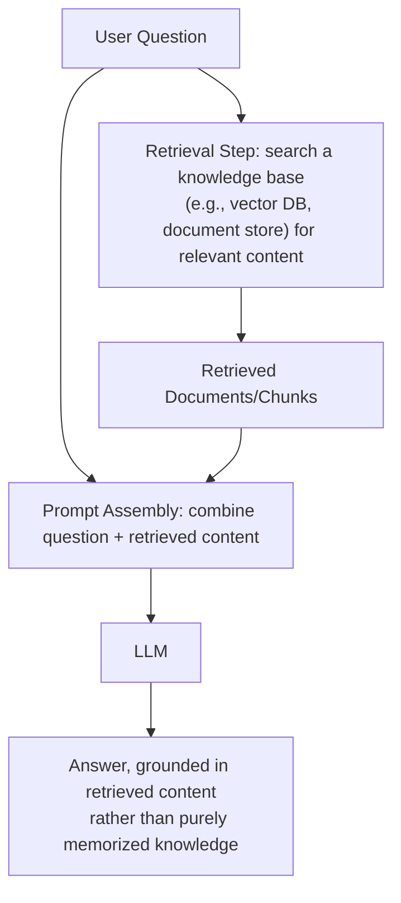
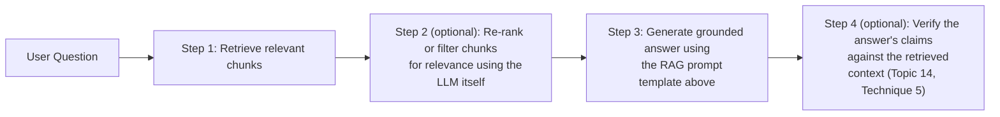

# 18. Retrieval-Augmented Prompting (RAG-aware Prompts)

## Why This Topic Is a Major Milestone

This topic is the natural convergence point of several earlier notes: hallucination mitigation (Topic 14) told you the single most effective fix is "ground responses in provided data instead of the model's memory." In-context learning (Topic 5) told you ICL can't inject genuinely new facts the model wasn't trained on. Prompt compression (Topic 17) told you to include only the relevant excerpt, not entire documents. **Retrieval-Augmented Generation (RAG)** is the architecture that ties all of these threads together into one coherent system — and it's explicitly listed as a Phase 2 topic in your own learning roadmap, so this note is your bridge from "prompt engineering" into "agent-building."

## The Core Idea

Instead of relying purely on what the model memorized during training, **RAG retrieves relevant information from an external knowledge source at request time, and inserts it into the prompt**, so the model answers based on real, current, or domain-specific data rather than (potentially outdated or absent) memorized knowledge.



## Why RAG Exists (Reasoning, Tying Back to Earlier Topics)

| Problem (from earlier topics) | How RAG addresses it |
|---|---|
| Models can't reliably know facts past their training cutoff (Topic 5) | Retrieval fetches current data at request time — the model doesn't need to have "known" it during training, because it's handed the relevant text directly, right now |
| Models hallucinate confidently when they don't actually know something (Topic 14) | Grounding the answer in explicitly provided source text shifts the task from "recall from memory" (high hallucination risk) to "read and summarize provided text" (much more reliable) |
| In-context learning can teach behavior but not inject new facts (Topic 5) | RAG doesn't rely on ICL to "teach" facts at all — it simply puts the actual needed facts directly into the context, so the model doesn't need to have learned them beforehand |
| Full documents are often too long/costly to include every time (Topic 17) | Retrieval selects only the most relevant chunk(s) for the specific query, rather than stuffing entire documents into every prompt |

## The Two-Stage Architecture

### Stage 1: Retrieval (Not an LLM Prompting Concern, But You Need to Understand It)

This stage typically works by:
1. Breaking your knowledge source (documents, wiki pages, past tickets, product manuals) into smaller **chunks**.
2. Converting each chunk into a numerical representation (an **embedding**) that captures its meaning.
3. At query time, converting the user's question into an embedding too, and finding the chunks whose embeddings are most similar (this is a **vector search**).

```java
// Conceptual flow (actual implementation uses a vector database
// and an embedding model, not literal string matching)
List<DocumentChunk> relevantChunks = vectorStore.similaritySearch(
    userQuery,
    topK = 3  // retrieve the 3 most relevant chunks
);
```

**Reasoning for why this matters even though it's not "prompting" per se:** The *quality* of what gets retrieved directly determines the quality of what the model can ground its answer in — this is a classic "garbage in, garbage out" dependency. No amount of clever prompt wording in Stage 2 can compensate for retrieval that fetched the wrong or irrelevant chunks; you can't ground an answer in facts that were never actually retrieved. As a developer moving toward Phase 2 of your roadmap, know that retrieval quality (chunking strategy, embedding model choice, similarity search tuning) is its own significant discipline — this note focuses specifically on the *prompting* side (Stage 2), since that's this roadmap's current focus, but be aware Stage 1 exists as an equally important, separate skill area you'll build later.

### Stage 2: Prompt Assembly (This Is Where Prompt Engineering Applies Directly)

```
Answer the question using ONLY the information in the context below.
If the answer is not contained in the context, say "I don't have
enough information to answer this" rather than guessing.

Context:
{{retrieved_chunk_1}}
{{retrieved_chunk_2}}
{{retrieved_chunk_3}}

Question: {{user_question}}
```

**Reasoning for each part of this template:**
- **"using ONLY the information in the context"** — explicitly instructs the model to prioritize the provided text over its own memorized (and potentially outdated or wrong) knowledge, directly applying the Topic 14 grounding technique.
- **The explicit fallback instruction ("say I don't have enough information")** — directly applies the "permit and reward I don't know" technique from Topic 14, specifically calibrated for the RAG case where retrieval might have failed to find a relevant chunk at all.
- **Clearly delimited context** — this connects to Topic 13 (Guardrails): if any retrieved chunk originates from an external or user-controlled source (a website, a user-submitted document), it should be treated with the same untrusted-content caution as any other external input, delimited clearly and never treated as instructions to follow.

## Handling Retrieval Failure Gracefully

A frequently overlooked failure mode: what happens when retrieval finds **nothing relevant** (e.g., the user asks about something genuinely not covered in your knowledge base)?

```
Context:
{{retrieved_chunks — possibly empty, or only weakly related}}

Question: {{user_question}}

If the context above does not contain information relevant to the
question, respond: "I don't have information on this topic in my
knowledge base" — do not attempt to answer from general knowledge.
```

**Reasoning:** Without this explicit instruction, a model presented with a question and some (even weakly relevant, or entirely irrelevant) retrieved context might still default to answering from its own general training knowledge, silently defeating the entire point of grounding the answer in your specific, verified knowledge source. This is especially important in domain-specific RAG applications (e.g., an internal company policy assistant) where an answer drawn from the model's general knowledge instead of your actual current policy could be subtly (or seriously) wrong.

## Citing Sources Within RAG Responses

```
Answer the question using the context below. After each claim,
indicate which numbered source it came from, like [Source 1].

Context:
[Source 1] {{chunk_1}}
[Source 2] {{chunk_2}}

Question: {{user_question}}
```

**Reasoning:** This directly extends the "ask for citations within provided context" hallucination-mitigation technique from Topic 14, applied specifically to the RAG setting where you have multiple distinct, numbered source chunks. Beyond just reducing hallucination risk, source citations give end users (and your own evaluation process, Topic 12) a way to verify a claim against the original material directly, and let you trace exactly which retrieved chunk influenced which part of the answer — valuable both for user trust and for debugging retrieval quality.

## RAG and Prompt Chaining Combine Naturally

A full RAG pipeline is often itself a small prompt chain (Topic 11):



**Reasoning for the optional re-ranking step (Step 2):** Vector similarity search (Stage 1) is a good first-pass filter but isn't perfect — it can occasionally retrieve chunks that are superficially similar in wording but not actually the most relevant to answering the specific question. An additional LLM-based re-ranking step (essentially, "of these 5 retrieved chunks, which 2 are actually most relevant to this exact question?") can improve final answer quality, at the cost of an additional call — the same latency/cost-vs-reliability trade-off pattern that's recurred throughout this roadmap (Topics 7, 11).

## RAG vs. Fine-Tuning — A Common Point of Confusion (Reasoning)

A common question: "why not just fine-tune the model on our company's documents instead of doing RAG?" It's worth understanding the reasoning for why RAG is usually preferred for knowledge-grounding use cases:

| Factor | RAG | Fine-tuning |
|---|---|---|
| Updating knowledge | Update the knowledge base/documents; no retraining needed | Requires retraining/re-fine-tuning the model — slower, more expensive |
| Source transparency | Can cite exact source chunks used | Knowledge becomes baked into weights — no way to trace which training example produced a given output |
| Cost to set up | Lower — mainly requires a retrieval system | Higher — requires training infrastructure and expertise |
| Best suited for | Injecting current/specific factual knowledge | Adjusting the model's general behavior, tone, or task-specific skill patterns |

**Reasoning:** Fine-tuning changes *how the model behaves* by adjusting its weights on training examples — it's a poor fit for injecting facts that change frequently (like current inventory, this week's policy update, or yesterday's news), because every update would require retraining. RAG separates "the model's general reasoning ability" from "the specific facts it needs right now," letting you update the facts (your knowledge base) independently and instantly, without touching the model at all. This is precisely why RAG, not fine-tuning, is the standard approach for the kind of knowledge-grounding use cases you'll build in Phase 2 of your roadmap.

## Key Takeaways

- RAG retrieves relevant external content at request time and inserts it into the prompt, letting the model ground its answer in real, current, or domain-specific data instead of relying purely on memorized training knowledge.
- Retrieval quality (Stage 1) is a separate discipline from prompt engineering (Stage 2) — but both matter equally; great prompting can't compensate for retrieval that fetched the wrong content.
- Always explicitly instruct the model to prioritize provided context over its own general knowledge, and to explicitly say when the provided context doesn't contain a relevant answer, rather than silently falling back to potentially wrong general knowledge.
- Treat retrieved content from external/untrusted sources with the same delimiting caution as any other untrusted input (Topic 13).
- Requesting source citations directly extends the hallucination-mitigation techniques from Topic 14 and adds real value for user trust and debugging.
- RAG is generally preferred over fine-tuning for knowledge-grounding use cases specifically because it separates updatable facts from the model's fixed weights — you update your knowledge base instantly, without ever retraining the model.

---
This completes **Phase E: Advanced Techniques**. Next: `19-tool-use-function-calling-prompts.md` — the first topic of **Phase F: Agent-Specific Prompting**, where everything in this roadmap starts converging directly into agent-building, the actual goal of your broader learning path.
