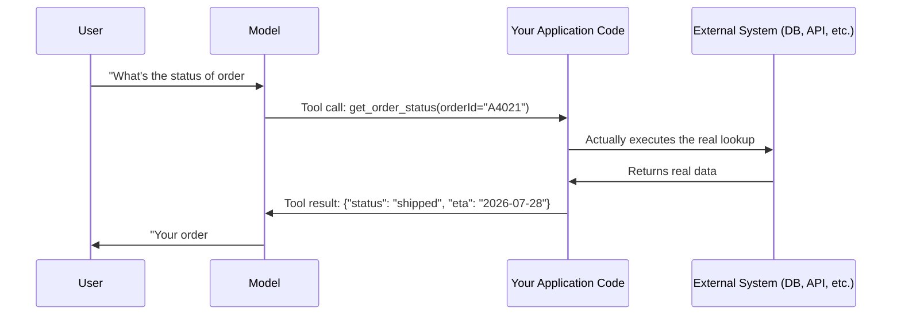

# 19. Tool-Use / Function-Calling Prompts

## Why This Topic Is a Turning Point

Every topic up to now has been about getting better *text* out of a model. This topic is where the model starts taking **actions** — calling real functions, hitting real APIs, querying real databases — based on its own decision about what's needed. This is the single most important prompting skill for agent-building, because an "agent" is, at its core, just an LLM that can decide to call tools and act on the results.

## What Tool Use / Function Calling Actually Is

You give the model a list of available **tools** (each with a name, description, and input schema — this is literally the same schema mechanism from Topic 9's structured-output technique). When the model determines a tool would help answer the request, instead of just writing text, it outputs a **structured tool call**: which tool to use, and with what arguments. Your application code then actually executes that call and feeds the result back to the model.



**Critical reasoning point:** The model **never directly executes anything itself**. It only ever outputs a structured *request* to call a tool with certain arguments — your application code is always the one that actually runs the real function, hits the real API, or queries the real database. This distinction matters enormously for security (Topic 13) — you are always the gatekeeper deciding whether and how to actually execute what the model requested.

## Defining a Tool (The Prompt-Engineering Part)

```java
Map<String, Object> getOrderStatusTool = Map.of(
    "name", "get_order_status",
    "description", "Retrieves the current shipping status and estimated delivery date for a specific order, given its order ID. Use this whenever the user asks about the status, tracking, or delivery of a specific order.",
    "input_schema", Map.of(
        "type", "object",
        "properties", Map.of(
            "orderId", Map.of(
                "type", "string",
                "description", "The order ID, e.g. 'A4021'. Must be provided by the user or already known from context — do not guess or invent an order ID."
            )
        ),
        "required", List.of("orderId")
    )
);
```

### Why the `description` Field Matters So Much (Reasoning)

The `description` is not just documentation for humans reading your code — **it is the exact text the model reads to decide when and how to use this tool.** This makes writing tool descriptions a genuine prompt-engineering task, not an afterthought.

| Description quality | Consequence |
|---|---|
| Vague: `"Gets order info"` | Model may call it at the wrong times, or not know it exists for a relevant question, or misuse the argument |
| Specific: `"Retrieves the current shipping status... Use this whenever the user asks about status, tracking, or delivery of a specific order."` | Model has clear, checkable criteria for exactly when this tool applies, reducing both under-use (missing an obvious case) and over-use (calling it for unrelated questions) |

**Reasoning:** This is the exact same "be explicit, not vague" principle from Topic 2 (Prompt Structure), applied specifically to tool descriptions. Just as a vague instruction produces unpredictable text output, a vague tool description produces unpredictable *tool selection* — and now the "wrong output" isn't just an unhelpful sentence, it's potentially the wrong real-world action being taken.

## Guiding the Model on WHEN to Use a Tool (System-Level Instructions)

Beyond individual tool descriptions, your system prompt should set overall expectations for tool usage:

```
<system>
You have access to tools for looking up order information. Use a
tool whenever you need real, current data you don't already have —
never guess or fabricate order details, statuses, or dates.

If a required piece of information (like an order ID) is missing from
the user's message, ask the user for it rather than guessing or
calling a tool with an invented value.
</system>
```

**Reasoning for the "never guess or fabricate... never call a tool with an invented value" instruction:** This is a direct, critical application of Topic 14 (Hallucination Mitigation) to the tool-use setting. Without this explicit instruction, a model might occasionally "hallucinate" a plausible-sounding argument (like inventing an order ID pattern) rather than recognizing the information is genuinely missing — and unlike a hallucinated *sentence*, a hallucinated tool call argument can trigger a real action against a real system with a wrong or fabricated input. This is arguably higher-stakes than any hallucination risk covered in Topic 14, precisely because it can propagate into a real-world side effect.

## Handling the Tool Result — Feeding It Back Correctly

Once your code executes the actual tool call and gets a result, that result needs to go back to the model as part of the conversation (recall Topic 4's `user`/`assistant`/`system` roles) so the model can use it to formulate its final answer.

```java
// Conceptual flow
List<Message> messages = new ArrayList<>();
messages.add(userMessage("What's the status of order A4021?"));

Response response = llm.call(messages, availableTools);

if (response.hasToolCall()) {
    ToolCall call = response.getToolCall(); // e.g., get_order_status(orderId="A4021")
    Object realResult = executeRealTool(call); // your actual DB/API call

    messages.add(assistantMessage(response)); // the model's tool-call request
    messages.add(toolResultMessage(call.getId(), realResult)); // feed the real result back

    Response finalResponse = llm.call(messages, availableTools);
    // finalResponse now contains the natural-language answer using the real data
}
```

**Reasoning:** This is a direct, concrete instance of prompt chaining (Topic 11) and the stateless-API principle from Topic 4 — the model has no memory of having "called" anything; from its perspective, the tool result is simply new information appearing in the conversation, the same way any other message would. Your code is responsible for faithfully representing both the model's tool-call request *and* the real result back into the message history, or the model will lose track of what it asked for and what it received.

## Handling Tool Errors Gracefully

```java
try {
    Object result = executeRealTool(call);
    messages.add(toolResultMessage(call.getId(), result));
} catch (Exception e) {
    // Feed the error back as a tool result too — don't silently drop it
    messages.add(toolResultMessage(call.getId(),
        "Error: order lookup failed - order ID not found"));
}
```

**Reasoning:** This directly extends the "always parse/handle defensively" discipline from Topics 9 and 11. If a tool call fails (invalid ID, service downtime, timeout) and your code doesn't feed *some* result back, the model is left with an unresolved tool call and no way to know what happened — leading to confusing or fabricated follow-up behavior. Explicitly feeding back an error message lets the model react sensibly (e.g., "I couldn't find that order — could you double-check the order ID?") rather than silently breaking or hallucinating an answer anyway.

## Multiple Tools and Tool Selection Ambiguity

When you provide several tools, the model has to choose the *right* one — and poor descriptions can cause it to choose incorrectly, especially when tools have overlapping-sounding purposes.

```
Bad (overlapping/ambiguous):
- "get_order_info" — "Gets info about an order"
- "get_order_status" — "Gets the status of an order"
(These sound nearly identical — the model may not reliably know which
one to prefer.)

Better (clearly differentiated):
- "get_order_shipping_status" — "Returns ONLY the shipping status and
  ETA for an order. Use for tracking/delivery questions."
- "get_order_full_details" — "Returns complete order details including
  items, price, and billing info. Use for questions about what was
  ordered or how much it cost."
```

**Reasoning:** This connects directly to the least-privilege principle from Topic 13 — not just for security, but for reliability too: narrow, clearly-scoped tools with non-overlapping, precisely worded descriptions are easier for the model to select correctly than broad, vaguely similar ones. As you design more tools for an agent, treat tool descriptions with the same rigor you'd apply to naming and documenting overloaded methods in code — ambiguity in either case leads to the wrong one being invoked.

## Key Takeaways

- Tool-use prompting means giving the model structured definitions of available actions (name, description, input schema) so it can request a tool call — but your application code always executes the real action, never the model directly.
- Tool `description` fields are genuine prompt-engineering content — the model uses that exact text to decide when and how to use the tool, so vague descriptions cause unpredictable tool selection, not just unpredictable text.
- Explicitly instruct the model never to guess or fabricate tool arguments when required information is missing — a hallucinated argument can trigger a real, wrong action, which is a materially higher-stakes failure than a hallucinated sentence.
- Tool results must be fed back into the conversation faithfully (both the request and the real result), because the model has no memory of having "called" anything outside of what's explicitly in the message history.
- Handle tool execution errors by feeding an explicit error result back, rather than leaving the model with an unresolved call and no information to react to.
- Design tools with clear, non-overlapping descriptions — the same least-privilege and clarity principles from earlier topics apply directly to tool design.

---
**Next up:** `20-react-prompting.md` — combining reasoning and tool use into an iterative Reason-Act loop, the architectural core of most modern AI agents.
