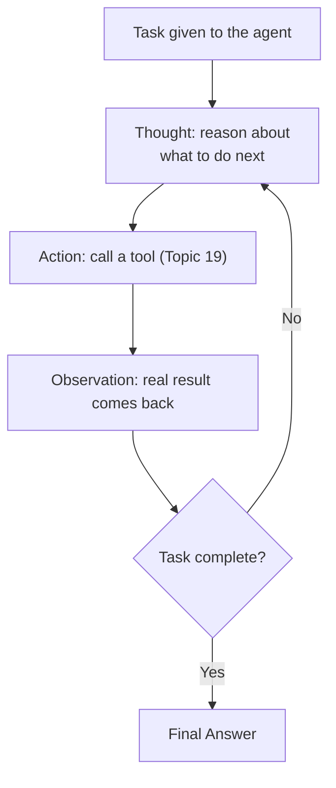

# 20. ReAct Prompting (Reasoning + Acting)

## Why This Topic Is the Center of Gravity for Agent-Building

If you only deeply understand one topic in this entire roadmap before starting Phase 2 of your broader learning plan, make it this one. **ReAct** (Reason + Act) is the pattern that combines Chain-of-Thought reasoning (Topic 6) with tool use (Topic 19) into a **repeating loop**, where the model reasons about what to do, takes an action, observes the result, and reasons again — repeating until the task is actually complete. This loop is the architectural backbone of the vast majority of real-world AI agents, including what you'll build with LangGraph.

## The Core Loop



This differs from both earlier techniques in a specific, important way:

| Technique | What it does | What it lacks |
|---|---|---|
| Chain-of-Thought (Topic 6) | Reasons step by step, but produces only text — no real-world actions | Can't gather new, real information mid-task; entirely dependent on what's already in the prompt |
| Tool Use (Topic 19) | Can call one tool once, based on the request | On its own, doesn't necessarily reason about *multiple* sequential steps or decide to call several tools in sequence based on intermediate results |
| **ReAct** | Reasons, acts, observes the real result, **and reasons again based on that new information** — repeating as many times as needed | — |

**Reasoning for why this combination matters:** Many real tasks can't be solved with a single tool call — they require gathering some information, then deciding what to do *next* based on what was just learned, potentially several times over. ReAct explicitly builds in this reasoning-observation-reasoning cycle, which is exactly what's needed for genuinely multi-step, adaptive tasks (as opposed to a single, predictable function call).

## A Worked Example

**Task:** "Is order A4021 eligible for a refund, and if so, process it."

```
Thought: I need to check the order's status and purchase date first,
since refund eligibility depends on both.
Action: get_order_details(orderId="A4021")
Observation: {"status": "delivered", "deliveredDate": "2026-07-10",
              "item": "headphones", "price": 49.99}

Thought: Delivered on 2026-07-10. Today is 2026-07-26, so that's 16
days ago — within the 30-day refund window. I need to check if this
item category is refund-eligible before proceeding.
Action: check_refund_policy(itemCategory="electronics")
Observation: {"refundable": true, "windowDays": 30, "restockingFee": 0}

Thought: The order is within the window and the category is
refundable with no restocking fee. I can proceed to process the
refund.
Action: process_refund(orderId="A4021", amount=49.99)
Observation: {"refundId": "R9981", "status": "processed"}

Thought: The refund has been successfully processed. I have enough
information to give the final answer.
Final Answer: Order A4021 was eligible for a refund (delivered 16
days ago, within the 30-day window). I've processed a refund of
$49.99 (refund ID R9981).
```

**Reasoning for why each step is structured this way:** Notice that **every action is preceded by an explicit Thought** justifying why that action is needed right now, based on what's known so far — this is the Chain-of-Thought discipline from Topic 6 applied specifically to *deciding the next tool call*, rather than just to producing a final text answer. And notice that **every action is followed by an Observation that directly informs the next Thought** — this is what lets the agent adapt its plan based on real, freshly-retrieved information, rather than following a rigid, pre-scripted sequence decided before any real data was available.

## Why Explicit "Thought" Steps Matter (Not Just Skipping to Actions)

You might wonder: why not just let the model call tools directly, without narrating a "Thought" each time?

**Reasoning:** Just as Chain-of-Thought (Topic 6) improves accuracy on reasoning tasks by giving the model a "scratchpad" instead of forcing an instant leap to a conclusion, the same benefit applies to *deciding which tool to call and with what arguments*. Skipping straight to actions forces the model to implicitly reason and act in one uninspectable step — explicit Thought steps make that reasoning visible, which gives you two major practical benefits:
1. **Debuggability** — if the agent takes a wrong action, you can see exactly which Thought led to it, and pinpoint whether the reasoning itself was flawed or the action was a reasonable choice given a flawed premise.
2. **Reduced impulsive/premature actions** — an agent that must articulate *why* an action is needed before taking it is less likely to take an unnecessary, redundant, or premature action than one that jumps directly to tool calls.

## Prompting for ReAct — The System-Level Instruction

```
<system>
You are an agent that solves tasks by reasoning and acting in a loop.
For each step, first write a "Thought" explaining your reasoning
about what to do next, then either take an "Action" (calling one of
the available tools) or, if you have enough information, provide a
"Final Answer".

Do not take an action without first stating a Thought explaining why
it's needed. Do not fabricate an Observation — only use real results
returned by actual tool calls. If a tool call fails, incorporate that
into your next Thought rather than assuming it succeeded.
</system>
```

**Reasoning for the "Do not fabricate an Observation" instruction:** This is a critical, ReAct-specific extension of the hallucination-mitigation discipline from Topic 14, applied here because the failure mode is particularly dangerous in a loop: if the model ever generates a *plausible-looking but fake* Observation instead of waiting for your application code to supply the real one, every subsequent Thought in the loop will build on fabricated data — compounding the error across every remaining iteration, rather than contaminating just one output. This is exactly the "cascading failure" risk flagged in Topic 11 (Prompt Chaining), but amplified because ReAct loops can run many more iterations than a simple linear chain.

## Termination Conditions — Preventing Infinite or Runaway Loops

A ReAct loop needs an explicit stopping condition, or it can run indefinitely (burning cost/tokens) or get stuck repeating similar unproductive actions.

```java
int maxIterations = 10;
int iteration = 0;

while (!taskComplete && iteration < maxIterations) {
    Response response = llm.call(messages, availableTools);

    if (response.hasFinalAnswer()) {
        taskComplete = true;
    } else if (response.hasToolCall()) {
        Object result = executeToolSafely(response.getToolCall());
        messages.add(assistantMessage(response));
        messages.add(toolResultMessage(result));
    }
    iteration++;
}

if (!taskComplete) {
    // Loop hit the iteration cap without resolving — escalate,
    // don't silently return an incomplete or fabricated answer.
    handleIncompleteTask();
}
```

**Reasoning:** Without a hard iteration cap, a bug in the model's reasoning (or a genuinely unsolvable task) can cause the loop to run indefinitely, directly translating into runaway API cost and unbounded latency — the agent equivalent of an infinite loop bug in traditional code, except each "iteration" here costs real money. Just as you'd never ship a `while` loop without a clear, guaranteed exit condition, never ship a ReAct loop without an explicit maximum iteration count and a defined fallback behavior (escalate to a human, return a partial/best-effort answer with a clear caveat, etc.) for when that cap is hit.

## Connecting Back to Guardrails (Topic 13)

Because ReAct loops actively call tools based on the model's own reasoning, every guardrail principle from Topic 13 applies with even more force here:

- **Least-privilege tool access** matters more, because the agent may chain together *multiple* tool calls autonomously — a single successful injection or reasoning error can now potentially trigger a *sequence* of unwanted actions, not just one.
- **Output-side validation for consequential actions** (e.g., requiring human confirmation before an agent actually processes a refund or sends an email) becomes an essential design pattern, not an optional extra, once the agent is making multi-step autonomous decisions rather than a single, directly-requested action.

## Key Takeaways

- ReAct combines Chain-of-Thought reasoning (Topic 6) with tool use (Topic 19) into a repeating Thought → Action → Observation loop, letting an agent adapt its plan based on real, freshly-retrieved information at each step.
- Explicit "Thought" steps before every action improve both debuggability and reduce premature/unnecessary actions — the same reasoning-as-scratchpad benefit from CoT, applied to action selection.
- Never let the model fabricate an Observation — an agent must wait for the real tool result, or a fabricated observation will compound errors across every subsequent loop iteration.
- Always implement a hard maximum iteration cap with a defined fallback behavior — an unbounded ReAct loop is a runaway-cost and runaway-latency risk, directly analogous to an infinite loop bug in traditional code.
- Guardrails from Topic 13 apply with greater force in ReAct systems, since the agent can autonomously chain together multiple real actions, not just one.

---
**Next up:** `21-multi-agent-prompt-design.md` — designing role-based prompts when multiple specialized agents collaborate on a task.
