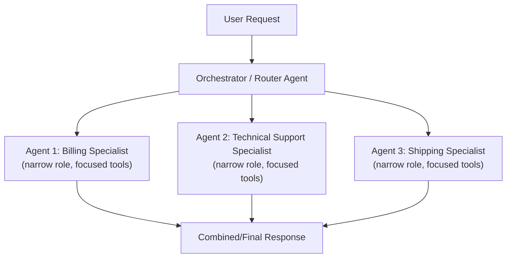
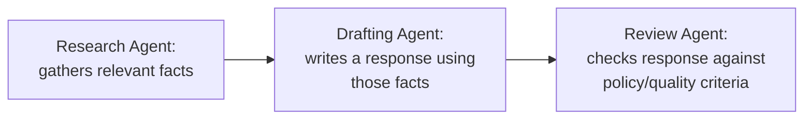
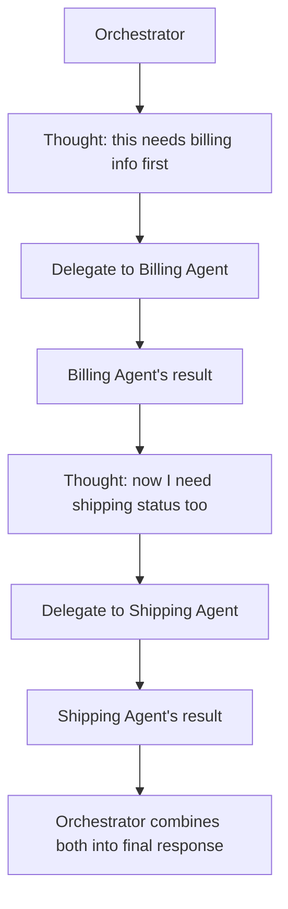

# 21. Multi-Agent Prompt Design

## Why Move Beyond a Single Agent

A single ReAct agent (Topic 20) reasons and acts in one continuous loop, using one system prompt and one set of tools. This works well for moderately complex tasks, but breaks down as complexity grows, for reasons directly analogous to why large software systems are split into multiple services rather than one giant monolith:

- **A single agent's system prompt becomes bloated** trying to cover every possible role, tone, and tool-selection rule for every sub-task type — this is the agent-level equivalent of a single class trying to do everything, violating single-responsibility.
- **Tool selection ambiguity increases** (recall Topic 19) as you add more and more tools to one agent's toolbox — an agent handling both "customer refunds" and "technical troubleshooting" and "sales inquiries" has to disambiguate between many more overlapping-sounding tools than a specialized agent would.
- **Debugging becomes harder** — if a single monolithic agent produces a wrong result, it's unclear whether the failure was in understanding the request, selecting a tool, or reasoning about the result, because everything happened inside one undifferentiated loop.

**Multi-agent design** addresses this by splitting a complex task across **multiple specialized agents**, each with a narrower role, its own tailored system prompt, and its own focused tool set — coordinated by some orchestration logic (this is exactly what frameworks like LangGraph and CrewAI, already in your learning roadmap, are built to manage).



## The Core Prompt-Design Skill: Role Specialization

Just as Topic 2 introduced "Role" as a component of a single prompt, multi-agent design elevates role-setting to the level of **entire agents**, each with a genuinely distinct persona, scope, and tool access — not just a different tone, but a fundamentally different job description.

```
Billing Agent system prompt:
"You are a billing specialist. You handle refunds, payment disputes,
and invoice questions ONLY. You have access to: process_refund,
get_invoice, update_payment_method. If a request falls outside
billing (e.g., a technical bug report), do not attempt to handle it —
respond that this should be routed to a different specialist."

Technical Support Agent system prompt:
"You are a technical support specialist. You handle bug reports,
error messages, and troubleshooting steps ONLY. You have access to:
get_error_logs, restart_service, check_system_status. If a request
falls outside technical support (e.g., a refund request), do not
attempt to handle it — respond that this should be routed to a
different specialist."
```

**Reasoning for explicitly telling each agent what it should NOT handle:** This directly extends the least-privilege reasoning from Topics 13 and 19, applied at the agent-design level rather than the individual-tool level — a narrowly scoped agent, explicitly instructed to recognize and decline out-of-scope requests rather than attempt them anyway, has a much smaller "blast radius" if something goes wrong, and is far easier to reason about, test, and evaluate (Topic 12) in isolation, since its entire behavior space is deliberately restricted to one domain.

## The Orchestrator / Router — A Prompting Problem in Its Own Right

Someone (or something) has to decide **which specialized agent should handle a given request** — this is usually a separate "orchestrator" or "router," and its prompt design is just as important as any individual specialist's.

```
Orchestrator system prompt:
"You are a routing agent. Given a user request, determine which
specialist should handle it: BILLING, TECHNICAL, or SHIPPING.
Do not attempt to answer the request yourself — only classify which
specialist it belongs to. If the request spans multiple categories,
identify all relevant ones in the order they should be handled."
```

**Reasoning:** This is structurally identical to the structured-output classification prompts from Topic 9 (extraction/classification into fixed categories) — the orchestrator's entire job is a classification task, not a generative one, so it should be prompted and evaluated (Topic 12) with the same rigor as any other classification prompt: clear category definitions, explicit handling of ambiguous/multi-category cases, and a strict, parseable output format.

## Two Common Multi-Agent Coordination Patterns

### Pattern 1: Sequential Handoff
Each agent completes its part and passes the (possibly updated) task state to the next agent in a defined sequence — this is essentially prompt chaining (Topic 11), but with each "link" in the chain being a full agent with its own system prompt and tools, rather than a single-purpose prompt.



**Reasoning for this structure:** Exactly the same reasoning as Topic 11's prompt chaining — each agent has one clear responsibility, and its output is independently inspectable, which matters even more here because each "step" is now a full agent capable of multiple internal reasoning/tool-use iterations (Topic 20), not just a single prompt call — meaning there's more surface area where something could go wrong, and correspondingly more value in clean, inspectable boundaries between stages.

### Pattern 2: Orchestrator with Dynamic Delegation
The orchestrator doesn't just route once at the start — it can call on different specialist agents as needed, potentially multiple times, based on how the task unfolds (similar in spirit to how a ReAct loop, Topic 20, decides on tool calls dynamically — except here, the "tools" being called are actually other full agents).



**Reasoning for when to prefer this over simple sequential handoff:** Sequential handoff assumes you know the fixed order of specialists needed upfront — appropriate for predictable, linear workflows. Dynamic delegation is needed when the *right sequence of specialists* genuinely depends on what's discovered along the way (e.g., you don't know if shipping info will even be relevant until you've checked the billing details first) — this mirrors exactly why ReAct (Topic 20) exists instead of a fixed, pre-scripted action sequence: adaptability to information only available mid-task.

## Preventing Agents From Stepping on Each Other's Scope

A subtle but important failure mode in multi-agent systems: without careful prompt design, two agents might both attempt to handle overlapping parts of a request, producing redundant, conflicting, or contradictory outputs.

**Reasoning-backed mitigation:** Just as Topic 19 emphasized non-overlapping, precisely-scoped tool descriptions to avoid tool-selection ambiguity, apply the same discipline to *agent* scope definitions — each agent's system prompt should explicitly state not just what it handles, but what it explicitly does NOT handle and should defer elsewhere, exactly as shown in the Billing/Technical Support example above. Ambiguous or overlapping agent scopes are the multi-agent-system equivalent of ambiguous or overlapping tool descriptions — the same root cause (unclear boundaries) produces the same symptom (unpredictable selection/behavior) at a different layer of the system.

## Shared Context Across Agents — A Real Design Challenge

Unlike a single agent that has one continuous message history (Topic 4), a multi-agent system has to explicitly decide **what context each specialist agent needs to see**, since giving every agent the entire conversation history indiscriminately reintroduces the same token-cost and irrelevant-context problems flagged in Topic 17 (Prompt Compression).

```java
// Don't blindly pass the entire conversation to every agent
BillingAgentInput billingInput = extractRelevantContext(
    fullConversation, scope = "billing"
);
```

**Reasoning:** This connects directly to Topic 17's compression principles and Topic 18's RAG-style "give the model only what it actually needs" philosophy — deciding what context to hand each specialist agent is itself a design decision with real cost and quality implications, not something to solve by simply forwarding everything to everyone. Frameworks like LangGraph provide structured ways to manage this shared/partitioned state explicitly, which is exactly why "state management across agents" is a core concept you'll encounter directly in your Phase 3 roadmap topic.

## Key Takeaways

- Multi-agent design splits a complex task across multiple specialized agents, each with a narrow role, tailored system prompt, and focused tool set — directly analogous to splitting a monolith into focused services, for the same underlying reasons (clarity, debuggability, reduced ambiguity).
- Each specialist's system prompt should explicitly state both what it handles AND what it should defer elsewhere — unclear agent boundaries produce the same unpredictable-selection symptom as unclear tool descriptions (Topic 19).
- The orchestrator/router is itself a classification prompting problem (Topic 9) and deserves the same evaluation rigor (Topic 12) as any other prompt.
- Sequential handoff suits predictable, linear workflows; dynamic delegation suits tasks where the right sequence of specialists depends on information only discovered mid-task — the same "fixed chain vs. adaptive loop" distinction from Topics 11 and 20.
- Deciding what context each agent sees is a deliberate design choice, not a default — blindly sharing full context with every agent reintroduces the cost/relevance problems from Topic 17.

---
**Next up:** `22-model-specific-prompting-quirks.md` — how prompting best practices differ across Claude, GPT, and open-source models.
