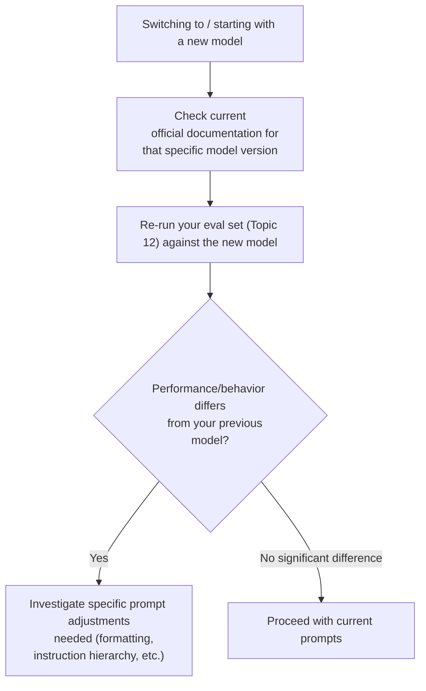

# 22. Model-Specific Prompting Quirks

## Why This Topic Matters for a Developer Working Across Tools

Everything covered in Topics 1-21 is largely **model-agnostic** — the underlying principles (clear roles, explicit constraints, structured output, ReAct loops) apply regardless of which LLM you're using. But specific model families have specific training conventions and quirks that affect exactly *how* to best apply those principles. Since your roadmap involves working with Claude (via Anthropic's API and Spring AI) but you'll likely also read about and possibly touch GPT and open-source models, this topic gives you the practical differences to be aware of, without needing to memorize every detail (this space also evolves quickly, so treat this as general orientation, not a permanently fixed reference).

## Claude (Anthropic) — Specific Conventions

### XML Tags Are a First-Class Citizen
Claude models are specifically trained to pay close attention to XML-style tags as structural delimiters — this isn't just "a nice convention," it's genuinely more reliably parsed by Claude specifically than by some other model families.

```xml
<role>You are a senior Java code reviewer.</role>
<context>Spring Boot 3.2, layered architecture...</context>
<instruction>Review this method for null-safety issues.</instruction>
```

**Reasoning:** This is why Topic 2 and Topic 13 both recommended XML tags for structuring prompts and delimiting untrusted content — this recommendation is especially well-supported for Claude specifically, though the general principle (structural separation improves reliability) is model-agnostic even if the specific tag-based mechanism is a Claude strength.

### Strong Instruction Hierarchy (System > User)
Claude models are explicitly trained to weight system-prompt instructions more heavily than conflicting instructions appearing later in user messages — this directly reinforces the Topic 4 and Topic 13 guidance to put non-negotiable rules in the system prompt, not just in the first user turn.

### "Thinking" / Extended Reasoning Support
Claude models support an extended, separate reasoning phase (sometimes surfaced as "thinking" content) for harder problems, distinct from the final response — conceptually similar to the Chain-of-Thought technique from Topic 6, but as a more formalized, separately-surfaced capability in newer Claude versions, rather than something you have to prompt into existence purely with wording like "think step by step."

**Reasoning for being aware of this without over-relying on memorized specifics:** Exact feature names, availability, and configuration change across model versions — always check current Anthropic documentation for the specific model version you're integrating against, rather than assuming a past version's exact feature set/API shape still applies.

## GPT (OpenAI) — General Differences to Be Aware Of

### Function-Calling Conventions
OpenAI's models popularized much of the tool/function-calling schema convention (Topic 19) that's now broadly similar, but not always byte-for-byte identical, across providers — the *concept* (name, description, JSON schema for arguments) transfers directly, but exact field names and request/response shapes can differ between providers' APIs.

**Reasoning for why this matters practically:** If you're building an abstraction layer that might swap between providers (a reasonable thing to want in a Spring AI-based system, which aims to abstract across providers), don't hardcode assumptions about one provider's exact tool-calling JSON shape into your core business logic — let the abstraction layer (Spring AI, or your own adapter) handle provider-specific translation, and keep your tool *descriptions and reasoning* (the actual prompt-engineering content) provider-agnostic wherever possible.

### System Message Weight Varies by Model Version
Different GPT model versions have, at different points, weighted system messages with varying degrees of strictness compared to user messages — this is an area where relying on a fixed, memorized assumption about instruction hierarchy is riskier than checking current documentation and testing empirically (Topic 12) for the specific model version you're targeting.

## Open-Source Models (Llama, Mistral, and similar) — General Considerations

### Prompt Format Sensitivity Can Be Higher
Many open-source models are more sensitive to the *exact* prompt template/format they were fine-tuned on (specific special tokens, specific role-tag formatting) than the larger commercial APIs, which tend to be more robust to format variation. Using the wrong chat template format for a specific open-source model can meaningfully degrade output quality in ways that aren't always obvious from the response alone — the model may still respond, just less capably than it would with the correct format.

**Reasoning:** This connects back to Topic 1's point about tokens and training patterns — a model's behavior is shaped by the specific patterns it saw during training/fine-tuning, and open-source models are often fine-tuned by parties who published a specific expected template. Deviating from that template is somewhat like calling a library function with subtly wrong argument types — it might not throw an obvious error, but it won't behave as designed either.

### Fewer Built-In Safety/Instruction-Following Guarantees
Commercial APIs (Claude, GPT) have extensive built-in training specifically targeting reliable instruction-following and safety behavior. Open-source base/community-fine-tuned models can vary widely in how reliably they follow the same categories of instruction (format constraints, role adherence, refusal behavior) — meaning the guardrail techniques from Topic 13 may need to be **more heavily reinforced through your own application-level defenses** (not just prompt wording) when working with less-tested open-source models, since you can't assume the same baseline of trained-in reliability.

## A Practical, Model-Agnostic Mindset (The Real Takeaway)

Rather than memorizing an exhaustive, ever-changing list of quirks, the most durable practical skill is this workflow:



**Reasoning for why this workflow matters more than memorized facts:** Model versions update frequently (as flagged in Topic 12's "continuous evaluation" discussion), and this specific topic area — model-to-model quirks — is one of the fastest-changing parts of this entire roadmap. A developer who has internalized "always verify against current docs and re-run the eval set when switching models" will stay reliably correct over time; a developer who has memorized a fixed list of quirks from a specific point in time risks operating on stale assumptions as models evolve. This is precisely the same "search for current information rather than rely purely on memorized facts" discipline that's valuable in software engineering generally, applied here specifically to model behavior.

## Why This Matters Specifically for Your Java/Spring AI Path

Since your roadmap explicitly plans to learn concepts via Python-based courses and then reimplement using Spring AI in Java, this topic has a direct practical implication: **Spring AI's abstraction layer is specifically designed to reduce your exposure to these provider-specific quirks**, letting you write more provider-agnostic application code. However, understanding that these quirks exist underneath the abstraction means you'll recognize *why* certain Spring AI configuration options or provider-specific settings exist, rather than treating them as arbitrary configuration — and it means you'll know to test specifically (Topic 12) whenever you do configure a provider-specific setting or switch model providers/versions underneath that abstraction.

## Key Takeaways

- Core prompt-engineering principles (Topics 1-21) are largely model-agnostic; this topic covers *how specific model families' training conventions* affect the best way to apply those principles.
- Claude specifically rewards structured XML tags and has a strong system-vs-user instruction hierarchy — directly reinforcing recommendations made in earlier topics.
- Open-source models can be more sensitive to exact prompt template formatting and may have less robust built-in guardrail behavior, meaning your own application-level defenses (Topic 13) may need to carry more weight.
- The most durable skill here isn't memorizing a fixed quirk list — it's the habit of checking current documentation and re-running your eval set (Topic 12) whenever you adopt a new model or model version.
- Frameworks like Spring AI exist specifically to abstract away many of these provider-specific differences — understanding the underlying quirks helps you use that abstraction intelligently rather than as an opaque black box.

---
**Next up:** `23-prompt-versioning-production.md` — managing prompts as first-class, versioned artifacts in a production system.
