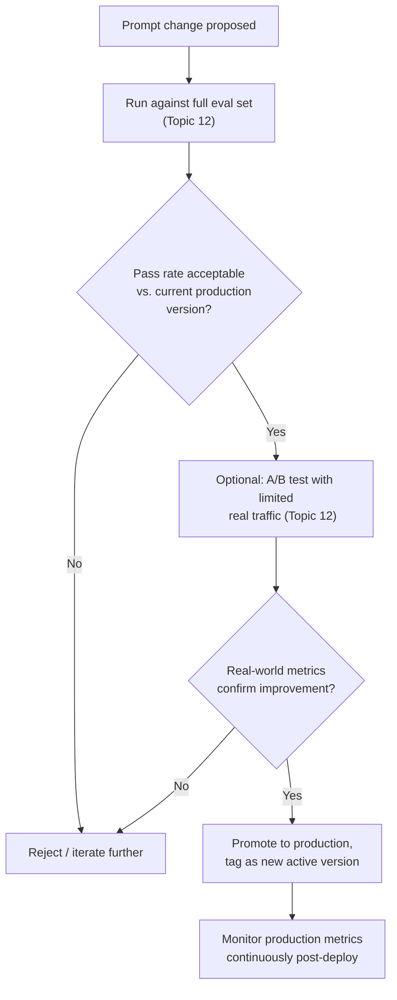
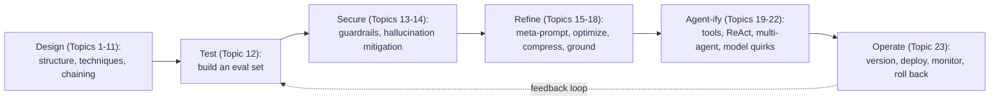

# 23. Prompt Versioning & Management in Production

## Why This Is the Right Topic to End On

This final topic ties together nearly every reasoning thread from the entire roadmap into one practical discipline: **treating prompts as production software artifacts**, with the same rigor you already apply to code — version control, testing before deploy, rollback capability, and monitoring. Everything from Topic 8 (templates), Topic 12 (evaluation), Topic 16 (optimization), and Topic 22 (model-version sensitivity) converges here into how you actually *operate* a prompt-driven system in production, day after day.

## The Core Principle: Prompts Are Code, Not Configuration Afterthoughts

**Reasoning for this framing:** A prompt change can alter your application's behavior just as significantly as a code change can — a single wording tweak can shift classification accuracy, break structured-output parsing (Topic 9), or introduce a security gap (Topic 13). Treating prompts as a lightweight, unversioned afterthought (e.g., a string literal edited directly in a config file with no history) exposes you to exactly the same risks you'd never accept for actual application code: untracked changes, no rollback path, no accountability for who changed what and why.

## Version Control for Prompts

```
prompts/
├── support_classification/
│   ├── v1.txt
│   ├── v2.txt
│   ├── v3.txt  (current production version)
│   └── CHANGELOG.md
```

Or, more realistically in a real system, prompts stored in a database with explicit version metadata:

```java
public class PromptVersion {
    String promptId;
    int version;
    String templateText;
    Instant createdAt;
    String createdBy;
    String changeDescription;
    boolean isActive; // is this the current production version?
}
```

**Reasoning:** This directly extends the "store templates externally and version them" guidance from Topic 8 into a fuller practice — every prompt change should be traceable to *exactly* what changed, *when*, *by whom*, and *why* (a brief change description), exactly like a git commit message for code. This traceability is what makes it possible to answer the inevitable production question "why did the agent's behavior change last Tuesday?" quickly and confidently, rather than through guesswork.

## Deployment Pipeline for Prompts — Mirroring CI/CD



**Reasoning:** This is a direct, deliberate parallel to a standard CI/CD pipeline for code — automated testing (the eval set) gates every change before it reaches production, with an optional canary/A/B phase for extra confidence on higher-stakes changes, exactly as discussed in Topic 12. Skipping this pipeline and directly editing a production prompt "live" is the prompt-engineering equivalent of directly editing code on a production server without any test suite or review — technically possible, but a well-known anti-pattern in traditional software for good reason, and no less risky here.

## Rollback Capability — Why It's Non-Negotiable

```java
public void rollbackPrompt(String promptId, int targetVersion) {
    PromptVersion target = promptRepository.findVersion(promptId, targetVersion);
    promptRepository.setActiveVersion(promptId, target);
    log.warn("Rolled back prompt {} to version {}", promptId, targetVersion);
    // Alert relevant team, since a rollback usually indicates a
    // production issue that needs follow-up investigation.
}
```

**Reasoning:** Even with rigorous eval-set testing (Topic 12) and A/B validation, real production traffic can occasionally surface an issue that testing didn't catch — this is true of ordinary code deployments too, which is exactly why rollback capability is considered a baseline requirement for production code deployment generally, not an optional nicety. A prompt-management system that can't quickly revert to a known-good previous version leaves you stuck manually reconstructing a fix under pressure, during an active production issue — exactly the scenario you want to avoid by having instant rollback ready beforehand.

## Monitoring Prompts in Production — What to Track

| Metric | Reasoning for tracking it |
|---|---|
| Output parse failure rate (Topic 9) | A rising rate of malformed/unparseable output is often the earliest concrete signal that something has changed — either in the model, the prompt, or the input distribution — even before any human notices a quality problem |
| Tool-call error rate (Topic 19) | Similarly, a spike in tool-call failures (invalid arguments, wrong tool selection) often surfaces a regression before it's visible in end-user-facing quality metrics |
| Token usage per request (Topic 17) | An unexpected jump can indicate a prompt bloat regression, a runaway ReAct loop nearing its iteration cap (Topic 20), or unexpectedly long retrieved context (Topic 18) |
| Eval-set pass rate over time, re-run periodically | Confirms a previously-passing prompt hasn't silently degraded due to an underlying model version update (Topic 22) — even if you didn't change your own prompt at all |
| Flagged/suspicious input rate (Topic 13) | Rising injection-attempt patterns may indicate a new attack vector being probed, warranting a fresh look at your guardrails |
| User-facing satisfaction/escalation signals | The ultimate ground-truth signal — but often lags behind the more immediate technical metrics above, so it shouldn't be your only monitoring signal |

**Reasoning for monitoring continuously, not just at deploy time:** This directly extends Topic 12's "continuous evaluation, not a one-time gate" principle into live production operation — model providers can update underlying models without you changing anything on your end (Topic 22), and real-world input distributions drift over time, meaning a prompt that was thoroughly validated at deploy time can still degrade in production weeks or months later without any code or prompt change on your part. Continuous monitoring is what catches this class of "silent drift" that a one-time launch validation cannot.

## Environment-Specific Prompt Management

Just as application code typically has dev/staging/production environment configurations, prompts benefit from the same separation:

```java
String promptId = "support_classification";
String environment = getCurrentEnvironment(); // dev, staging, production
PromptVersion active = promptRepository.getActiveVersion(promptId, environment);
```

**Reasoning:** This lets you test a candidate prompt version thoroughly in a staging environment (against synthetic or replayed real traffic) before it ever reaches production users — the same "test in staging before production" discipline you already apply to code deployment, applied here specifically to prompt changes, which as established throughout this topic, carry just as much behavioral risk as code changes do.

## Documentation Alongside Versioning

Beyond just storing the prompt text and a version number, maintain a lightweight changelog explaining *why* each version changed:

```markdown
## v3 (2026-07-20)
- Fixed: model occasionally wrapped JSON output in markdown code
  fences, breaking the parser (see Topic 9). Added explicit
  "nothing else" instruction to output format section.
- Eval set pass rate: 94% -> 98%

## v2 (2026-06-15)
- Added explicit refund-policy context after observing the model
  incorrectly approving out-of-window refund requests in production.
- Eval set pass rate: 87% -> 94%
```

**Reasoning:** This is exactly a commit-message discipline applied to prompts — future you (or a teammate) debugging an unexpected behavior months from now benefits enormously from being able to see not just *what* changed, but *why*, and what measurable effect that change had on the eval-set pass rate at the time. Without this, prompt history degenerates into an opaque sequence of text diffs with no narrative explaining the reasoning behind each change — exactly the kind of undocumented codebase that's painful to maintain and debug later.

## Bringing the Whole Roadmap Together

This final topic is really a synthesis of the entire roadmap's reasoning, applied to the operational lifecycle of a prompt:



**Reasoning for the feedback loop back to Test:** Production monitoring (this topic) frequently surfaces new failure patterns or edge cases that should be added directly to your eval set (Topic 12) — closing the loop between "what actually happens in production" and "what your automated testing checks for," so your eval set keeps growing in relevance rather than staying frozen at whatever you thought to test on day one.

## Key Takeaways

- Prompts are production artifacts with real behavioral impact — treat them with the same version control, testing gate, rollback capability, and change documentation discipline you already apply to application code.
- A proper deployment pipeline for prompts mirrors CI/CD: automated eval-set testing before promotion, optional A/B validation with real traffic, and continuous post-deploy monitoring — never edit a production prompt directly without going through this gate.
- Monitor concrete technical signals (parse failure rate, tool-call error rate, token usage, eval-set pass rate over time, suspicious-input rate) continuously, not just at launch — model updates and input drift can silently degrade a previously-validated prompt over time.
- Maintain a lightweight changelog alongside version history — documenting *why* each change was made is what makes prompt history genuinely useful for future debugging, not just a sequence of undocumented text diffs.
- Production monitoring should feed back into your eval set — every real-world failure pattern discovered in production is a candidate new test case, keeping your evaluation discipline (Topic 12) continuously relevant rather than static.

---
This completes **Phase F: Agent-Specific Prompting**, and with it, the full Prompt Engineering roadmap (Topics 1-23). You now have the complete conceptual and practical foundation to move confidently into **Phase 2 of your broader agent-building roadmap**: implementing tool use, memory, ReAct loops, and RAG hands-on with Spring AI and LangGraph.
