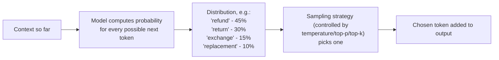
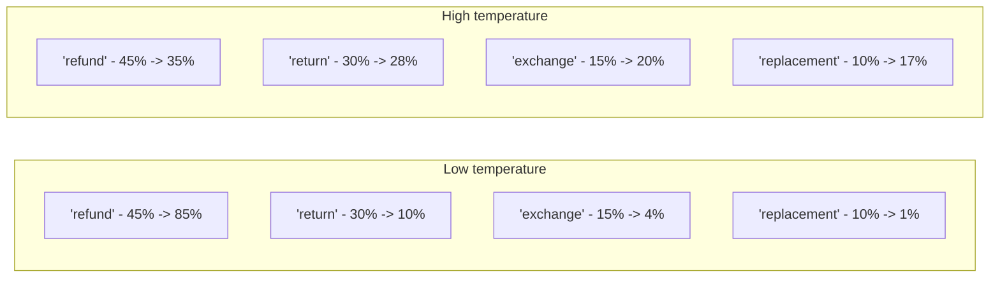
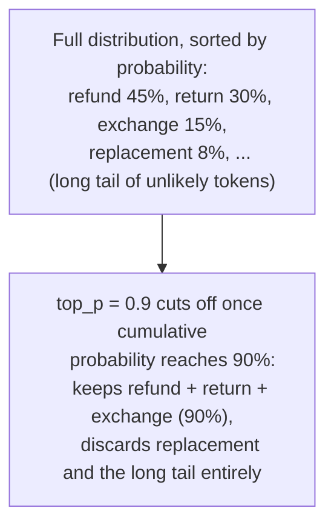
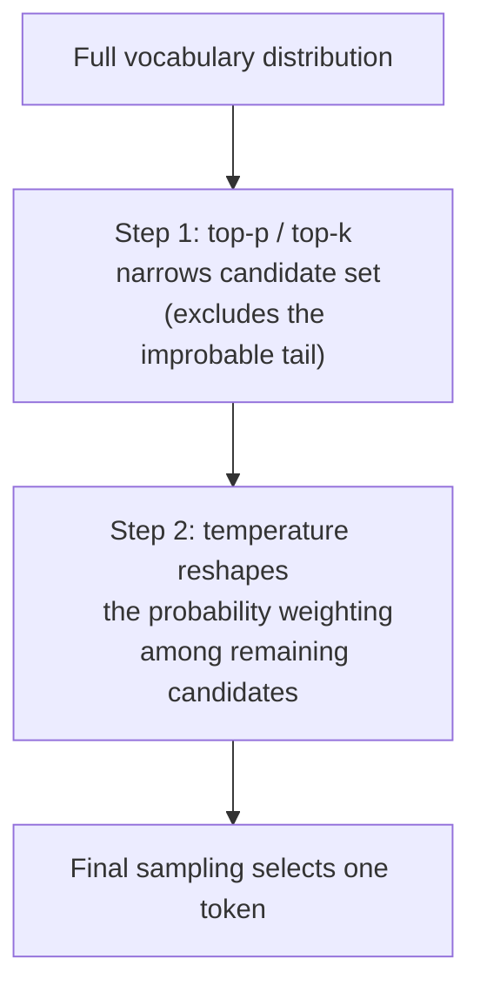

# 24. Sampling Parameters (Temperature, Top-p, Top-k)

## Why This Topic Belongs Here

Every technique so far has been about *what you write in the prompt*. This topic is about a completely different lever: **API-level parameters that control how the model selects its next token**, independent of the wording of your prompt at all. These have been referenced in passing since Topic 7 (Self-Consistency) and Topic 14 (Hallucination Mitigation) — this note pulls them together into one proper reference, since understanding them well is essential once you're calling models programmatically (which you will be, constantly, in agent-building).

## The Underlying Mechanic: How a Model Picks the Next Token

At every step of generation, the model doesn't just output one fixed "correct" next token — it computes a **probability distribution over its entire vocabulary** (every possible next token), and then a *sampling strategy* decides which one actually gets chosen.



**Reasoning for why this matters:** This is the mechanical explanation *behind* everything Topic 1 said about LLMs being probabilistic — the parameters in this topic are literally the dials that control how that probability distribution gets turned into an actual choice. Understanding this turns "temperature" from a mysterious magic number into a concept with a clear, mechanical meaning.

## Temperature

**What it does:** Temperature scales how "sharp" or "flat" the probability distribution is before a token gets sampled from it.

- **Low temperature (e.g., 0.0–0.3):** The distribution gets sharpened — the most likely token becomes even more dominant, so the model reliably picks the highest-probability option almost every time. At `temperature = 0`, this becomes fully deterministic (the same input reliably produces the same output).
- **High temperature (e.g., 0.7–1.0+):** The distribution flattens — lower-probability tokens get a real chance of being picked, producing more varied, less predictable output.



### Choosing Temperature for a Task (With Reasoning)

| Task type | Recommended temperature | Reasoning |
|---|---|---|
| Structured data extraction (Topic 9), classification | Low (0.0–0.2) | There's one genuinely correct answer — you want the model reliably picking its most confident choice every time, and you want repeated calls on the same input to produce consistent results |
| Factual Q&A / RAG-grounded answers (Topic 18) | Low (0.0–0.3) | Reduces unnecessary variability layered on top of the hallucination risk already discussed in Topic 14 — you want the model's most likely (and hopefully best-grounded) continuation, not a creative departure from it |
| Self-Consistency sampling (Topic 7) | Moderate (0.5–0.8) | You specifically *need* variation across multiple calls for majority voting to be meaningful — a temperature of 0 would produce near-identical outputs every time, defeating the entire technique |
| Creative writing, brainstorming, varied phrasing | High (0.7–1.0) | You want genuine variety and less predictable phrasing — a low temperature here would make output feel repetitive and formulaic |
| ReAct loops / tool-call decisions (Topic 20) | Low (0.0–0.3) | You want the agent reliably choosing the most sensible next action given its reasoning, not creatively exploring unlikely tool choices — unpredictability here directly translates into unpredictable real-world actions |

**Reasoning for defaulting to low temperature in agent/production systems specifically:** Since Topic 12 established that reliability and consistency are core requirements for anything production-facing, and since Topic 20 flagged that tool-call decisions can trigger real actions, the default posture for most agent-building work should be **low temperature**, reserving higher temperature specifically for the narrow cases (self-consistency sampling, genuinely creative generation) where variability is an explicit, deliberate goal rather than an unwanted side effect.

## Top-p (Nucleus Sampling)

**What it does:** Instead of considering the entire vocabulary, top-p restricts sampling to the smallest set of tokens whose **cumulative probability** adds up to at least `p`. For example, `top_p = 0.9` means: only consider the most likely tokens that together account for 90% of the total probability mass, and ignore the long tail of unlikely tokens entirely, before applying temperature-based sampling among what remains.



**Reasoning for why this exists alongside temperature:** Temperature alone still leaves a small chance of picking a very unlikely, potentially nonsensical token, especially at higher temperature settings. Top-p adds a **safety floor** — it excludes the genuinely improbable long tail of tokens entirely, regardless of temperature, reducing the risk of a bizarre or incoherent token slipping through while still preserving meaningful variety among the plausible candidates. Many practical setups combine a moderate temperature with a top-p around 0.9–0.95 as a sensible default for generative (non-deterministic) tasks.

## Top-k

**What it does:** A simpler, older sibling of top-p — instead of a cumulative probability cutoff, top-k just keeps the `k` single most likely tokens (e.g., `top_k = 40` keeps only the 40 most probable next-token candidates) and samples among those.

**Reasoning for why top-p is often preferred over top-k in practice:** Top-k uses a **fixed count** regardless of how the probability is actually distributed — if the model is very confident (one token at 95%), top-k might still needlessly include 39 near-irrelevant alternatives; if the model is genuinely uncertain across many plausible options, top-k might cut off legitimate candidates too aggressively. Top-p adapts to the actual shape of the distribution at each step, which is generally a more principled cutoff — this is why top-p is more commonly used as the primary "nucleus" control in most modern APIs, with top-k available as a secondary/legacy option.

## How These Parameters Interact



**Reasoning for understanding the order of operations:** Since top-p/top-k narrows the *candidate pool* first, and temperature then reshapes *how sampling behaves within that pool*, the two settings aren't fully independent — a very restrictive top-p combined with a very high temperature can still produce fairly repetitive output (since there's a small pool to begin with), while a permissive top-p combined with low temperature will still reliably pick the top candidate most of the time (since sharpening a distribution that already includes the full plausible range doesn't change much about which token wins). In practice, most developers adjust temperature as the primary lever and leave top-p at a sensible default (often left unchanged or set once near 0.9–1.0), rather than tuning both aggressively at the same time — treat top-p/top-k as a secondary safety net, and temperature as your primary, task-driven control.

## Practical Guidance for Developers

```java
Map<String, Object> requestBody = Map.of(
    "model", "claude-sonnet-4-6",
    "max_tokens", 1024,
    "temperature", 0.2,  // low: this is a structured extraction task
    "messages", List.of(
        Map.of("role", "user", "content", "Extract order details as JSON: ...")
    )
);
```

**Reasoning for treating temperature as a per-task-type configuration, not a global default:** Just as Topic 11 (Prompt Chaining) noted that different stages of a pipeline can use different settings, a system that both extracts structured data (needs low temperature) and drafts customer-facing prose (benefits from a bit more variety) should configure temperature **per call type**, not use one blanket value across the entire application — treat it as a parameter of the specific task, exactly like you would choose different logging levels for different components rather than one global setting.

### Always Validate — Don't Assume `temperature = 0` Guarantees Perfect Determinism

**Reasoning:** Even at `temperature = 0`, minor infrastructure-level non-determinism (e.g., floating-point computation differences across hardware/batching) can occasionally produce slightly different output for the identical input, especially across different points in time or different backend instances. Don't build critical logic that assumes byte-for-byte identical output is absolutely guaranteed — apply the same "always parse/validate defensively" discipline from Topics 9 and 19 regardless of how deterministic your temperature setting theoretically should be.

## Key Takeaways

- Temperature, top-p, and top-k are API-level parameters controlling *how* the model samples its next token from its computed probability distribution — a completely separate lever from prompt wording.
- Low temperature (near 0) favors reliable, consistent, most-likely output — the right default for extraction, classification, RAG-grounded answers, and agent tool-call decisions where consistency and predictability matter most.
- Higher temperature deliberately introduces variety — appropriate for creative generation, or specifically needed for techniques like Self-Consistency (Topic 7) where multiple *different* reasoning attempts are the whole point.
- Top-p (nucleus sampling) excludes the improbable long tail of tokens before temperature is applied, acting as a safety net against bizarre/incoherent token choices; top-k does something similar with a fixed candidate count and is generally considered a less adaptive, older approach.
- Configure sampling parameters per task type within your application, not as one global setting — and never assume even `temperature = 0` guarantees perfectly identical output every single time, so keep validating defensively regardless.

---
This is a supplementary topic to **Phase F: Agent-Specific Prompting** — with this, your roadmap now covers both the *prompt-text* side and the *API-parameter* side of controlling model behavior, giving you the full toolkit before moving into Phase 2 of your broader agent-building roadmap.
